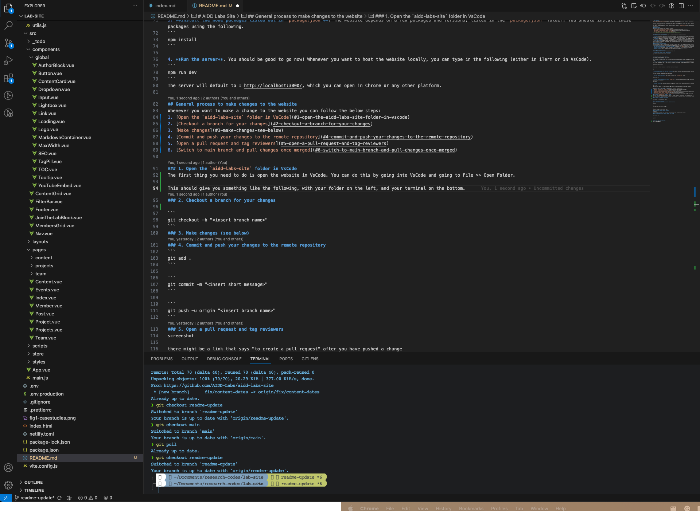
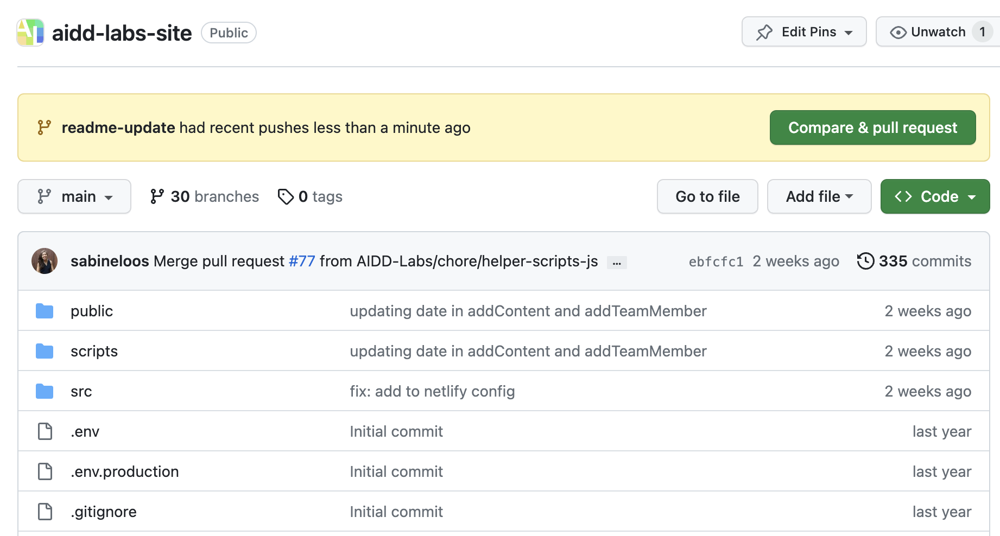
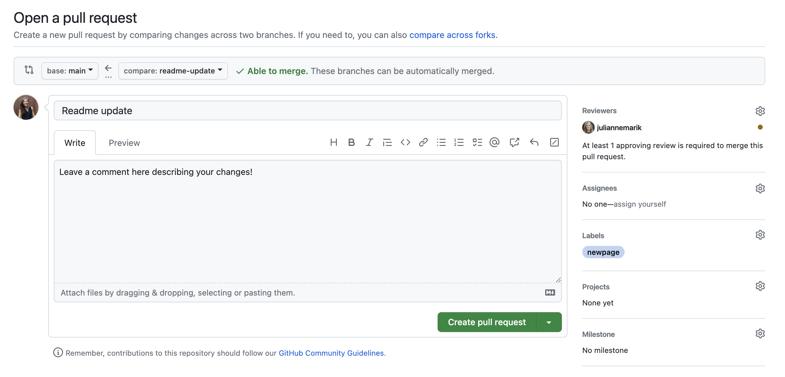
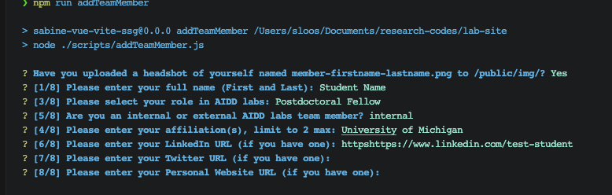
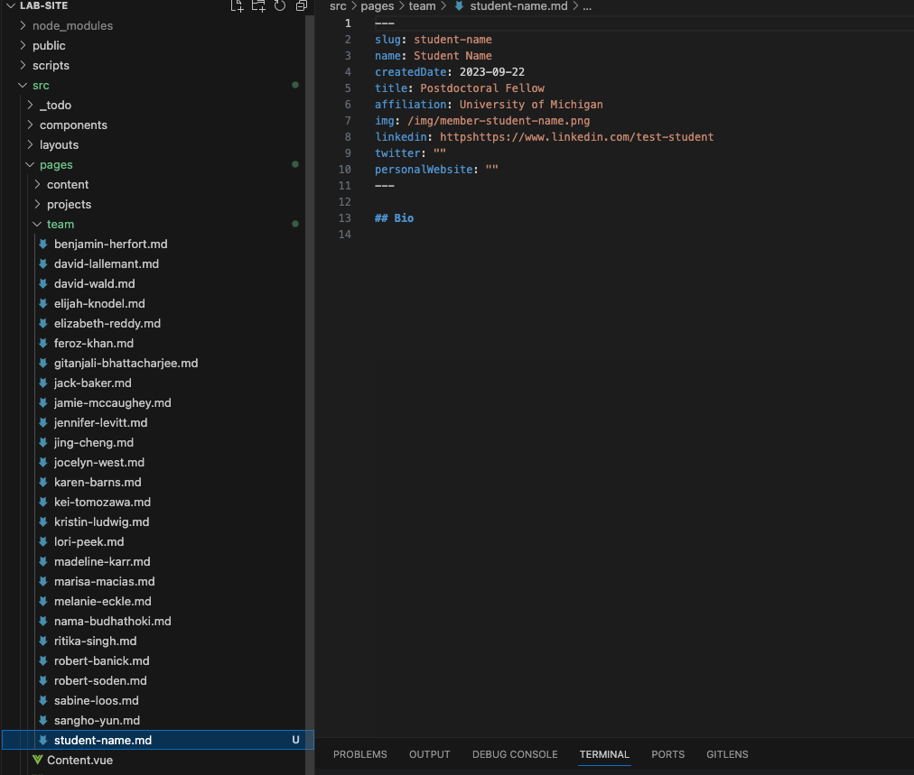
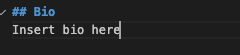

# AIDD Labs Site
This github repository is for the website for AIDD Labs at The University of Michigan, led by Dr. Sabine Loos. The website can be found at: 
[https://disasterdata.engin.umich.edu](https://disasterdata.engin.umich.edu).

The below instructions should help you as a lab member update your webpage(s) on the AIDD Labs website. Adding and maintaining your webpage(s) is also a great way to get comfortable with Git and Markdown.

This website was made based on the initial Vue-Vite framework created by [@marguerite-roth](https://github.com/margueriteroth) and updated with [@juliannemarik](https://github.com/juliannemarik).

## Table of contents
Specifically, this guide will help you do the following:
- [Understand the main components of the AIDD Labs website](#components-of-the-AIDD-Labs-website)
- [Set up the website locally on your computer](#setting-up-your-local-environment)
- [Make changes to the website and request a review](#general-process-to-make-changes-to-the-website)
- [Add and/or update *your profile* on the "Team" page](#insert)
- [Add and/or update *new content* to the "Content" page](#insert)
<!-- - [Add and/or update a *new project* to the "Projects" page](#insert) -->

## Components of the AIDD Labs website
This github repo might seem intimidating, but we can boil it down in a few main components.

1. **Github**: Github is a really useful platform that helps you host and collaborate on coding projects with others. It also allows you to track versions of code. Github is where the code of the AIDD Labs website lives (outside of our computer). We can consider the code on the `main` branch on Github as the "live" version of our website. For more information on Github, visit [their docs](https://docs.github.com/en/get-started/quickstart/hello-world).
2. **Markdown**: Markdown is a lightweight way to add formatting to plain text documents. This README is written in Markdown. Most of the webpages that you will have to maintain will be written in Markdown. We wrote many of the webpages in Markdown, because it is very easy to learn and it a useful  language to become familiar with. For more information, visit [their docs](https://www.markdownguide.org/getting-started/).
3. **Vue, HTML and CSS**: HTML and CSS are languages typically used for front-end development (aka to make websites). These have a large learning curve and are not terribly useful for you to learn, but these are the languages that are being used under the hood. If you want to develop any custom webpages, you will need to learn these. Please check with Sabine before delving into this.

## Setting up your local environment
In order to update or add to the website, you first need to get the code on your laptop! Before you get started, you need to make sure you have the following set up:
* **A terminal installed**. Mac comes with one, but I typically use [iTerm2](https://iterm2.com/). We have a resource page in our [Lab Notion](https://www.notion.so/aidd-labs/Setting-up-your-terminal-for-macs-16fc5c4406fe4b328b407f9a2802fe77?pvs=4) on how to set up iTerm2 on your laptop.
* **An IDE (integrated development environment) installed**, I recommend using [VSCode](https://code.visualstudio.com/).
* **Node installed**, download and install following the instructions here: https://nodejs.org/en/download/.
* **Volta installed**, download and install following the instructions here: https://volta.sh/.  
* **A Github account**,  set up a github account and configure git (see below).

### Configuring git on your laptop
In the VsCode terminal, enter the following to configure git.

1. **Set your git username for all repositories** 
```
git config --global user.name “<enter username>“
```

2. **Set VsCode as your git text editor** 
```
git config --global core.editor "code --wait"
```
### Cloning to your local repository
Your first step is to get the code from our "remote repository" on Github (https://github.com/AIDD-Labs/aidd-labs-site) to your "local repository" on your laptop. Follow the below steps.

1. **Open your terminal and go into the folder that you want to clone your repository in.** Open your built-in terminal or iTerm2 and  use `cd` to navigate to the folder where you'd like to keep the AIDD Labs code in. For now, we'll assume you have a folder called "code-directory" in your documents folder. 

```
cd Documents/code-directory
```

You can use `ls` to see everything in the folder you're currently in.

```
ls
```

2. **Clone the github repo into your local directory**. Now you can clone the remote repository to your local code directory. 

```
git clone git@github.com:AIDD-Labs/aidd-labs-site.git
```

2. **Go into the lab-site folder**. You now want to go into your `aidd-labs-site` folder.
```
cd aidd-labs-site
```

3. **Install the node packages listed out in `package.json`**. The website depends on a few packages and versions, listed in the `package.json` folder. You should install these packages using the following.
```
npm install
```

4. **Run the server**. You should be good to go now! Whenever you want to host the website locally, you can type in the following (either in iTerm or in VsCode).
```
npm run dev
```
The server will default to : http://localhost:3000/, which you can open in Chrome or any other platform.

## General process to make changes to the website
Whenever you want to make a change to the website you can follow the below steps:
1. [Open the `aidd-labs-site` folder in VsCode](#1-open-the-aidd-labs-site-folder-in-vscode)
2. [Checkout a branch for your changes](#2-checkout-a-branch-for-your-changes)
3. [Make changes](#3-make-changes-see-below)
4. [Commit and push your changes to the remote repository](#4-commit-and-push-your-changes-to-the-remote-repository)
5. [Open a pull request and tag reviewers](#5-open-a-pull-request-and-tag-reviewers)
6. [Switch to main branch and pull changes once merged](#6-switch-to-main-branch-and-pull-changes-once-merged)

### 1. Open the `aidd-labs-site` folder in VsCode
The first thing you need to do is open the website in VsCode. You can do this by going into VsCode and going to File >> Open Folder.

This should give you something like the following, with your folder on the left, and your terminal on the bottom.


### 2. Checkout a branch for your changes
Before you make any changes to the code, **YOU NEED TO CHECKOUT A BRANCH TO MAKE ALL YOUR CHANGES ON**. 
This is best practice when working on any collaborative code. That way you don't mess up whatever the working code is with your changes.

To create a new branch, type the following into the terminal:
```
git checkout -b "<insert branch name>"
```

You will automatically be in a new branch, but you can always check what branch you're in by typing the following:
```
git rev-parse --abbrev-ref HEAD
```
### 3. Make changes (see below)
Once you're in your new branch, you can update any part of the code that's relevant to you (See below on updating your profile or adding new content).
### 4. Commit and push your changes to the remote repository
Once you're done making changes, you need to add and commit those changes to git. 

You first need to add all your changes by typing the following in the terminal:
```
git add .
```
You then want to commit your changes. Please use a descriptive message for your changes.

```
git commit -m "<insert short message>"
```

Finally, you can push your changes to the remote repository. Make sure to insert your branch name!
```
git push -u origin "<insert branch name>"
```
### 5. Open a pull request and tag reviewers
Once you push your changes to git and you think they are ready to go live, you can open github and create a pull request. Typically github will recognize if there was a recent push to a branch and will recommend that branch for a pull request:


Hit the compare & pull request.

When you're opening your pull request, please do the following:

* Add a descriptive enough comment for me to understand what changes you made.
* Add me as a "Reviewer"
* Add a Label (likely "newpage")



Once you create a pull request, I'll be notified and will review your changes and merge it into the main branch if it's okay to merge. 
### 6. Switch to main branch and pull changes once merged
After I've merged your pull request, you'll want to update your local repository. To do this you will need to first switch to the main branch using the following in your terminal:

```
git checkout main
```

Once you're in the main branch, you can then pull in the latest changes:
```
git pull
```
And voila! You've successfully updated the website.

## Add or update your team member profile (aka you)
All team members are listed here: [https://disasterdata.engin.umich.edu/team](https://disasterdata.engin.umich.edu/team). You can add yourself to the website (or update your website profile). Make sure you have the following ready:

* A photo/headshot of yourself
* A short bio
* Any websites or social media links you want to include

To add or update your profile, follow the below steps:

### 1. Upload your headshot
Name your headshot "member-firstname.png". Make sure it's a png! You can upload this into the public>>img folder.

### 2. Run addTeamMember to add yourself
Then, in your terminal, run the following command:

```
npm run addTeamMember
```
This will prompt you through several items:


### 3. Confirm and complete your profile page
Once you complete these prompts, you sould find a markdown file under src >> pages >> team with your name on it and all the information you filled out:


The final thing to do is add your bio in the markdown file under the Bio header

