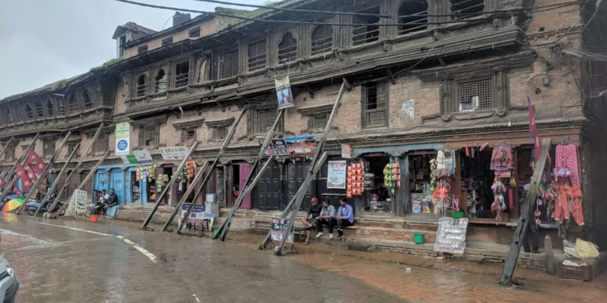
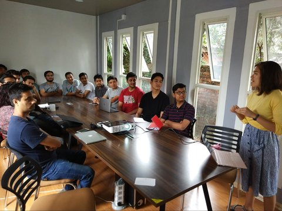

    <!-- Not totally sure why the public paths are failing the build rn. Todo. -->
    

About a month ago, I was standing in front of a small conference room presenting to a group of Nepali civic tech enthusiasts about my professional journey to Kathmandu Living Labs (KLL). I received many thoughtful questions at the end of my presentation, but I’ve been reflecting on my answer to one specific question since I returned from my extended visit to Nepal. This question was posed by one of KLL’s interns, who has been deciding on which subject to study at university. He asked, “Why civil engineering?” Harmless enough, but we could extrapolate. Why are buildings and infrastructure important? I said something along the lines of: well, in my opinion, buildings and infrastructure systems make up the basis of civilization. After a disaster, having these basic needs covered, like safe shelter, frees up our minds to focus more on our next level of pursuits.

<em> Loos presenting at Kathmandu Living Labs – July 2018 </em>

Thinking back to this moment, I’m not entirely satisfied with this answer. The obvious reason being that basic, physiological needs are comprised of much more than just safe shelter. At the same time, I didn’t acknowledge the incredible importance of the information required to advance decisions that fulfill these basic societal needs and support further development.

To make this more tangible, let’s take the example of the aftermath of the 2015 Nepal earthquake. From an engineering point of view, I could look at the extensive building damage that happened after the 2015 earthquake and say to myself – we need to design and build back better and safer buildings so this doesn’t happen again. Sure, but how does everyone with a damaged home get the money to build back better? And what if they didn’t have sufficient means to build safely, to begin with? Is ‘building back’ even important to those who were most affected? Often, these decisions are in the hands of national governments along with international and local NGOs, especially in developing countries like Nepal. But how do these groups create plans and policies on how to recover? Hopefully, based mostly on relevant information they obtain.

Because communities rely on this information after a disaster, we have brought together a team of civil engineers, disaster risk and recovery specialists, social scientists, and civic technologists to develop “Informatics for Equitable Recovery.” We’re re-evaluating how post-disaster impact information is collected and analyzed, using the 2015 Nepal earthquake as an initial case study.

<Link is-button to="https://urbanresilience.stanford.edu/news/informing-equitable-disaster-recovery-more-just-economic-losses"> Read the full blog post here </Link>