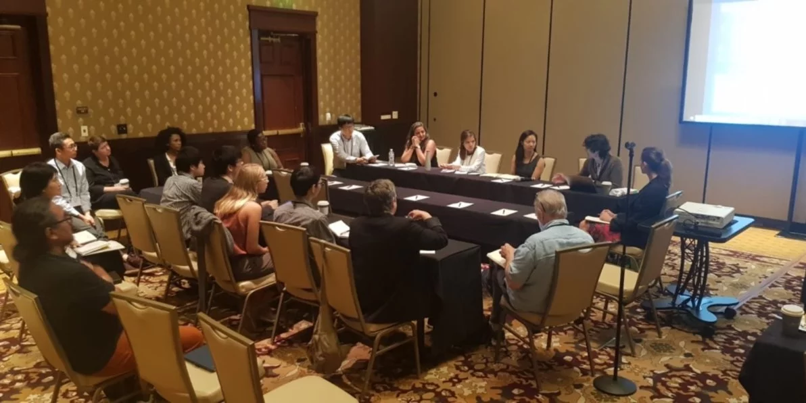

    <!-- Not totally sure why the public paths are failing the build rn. Todo. -->
    

Monday morning, July 15, 2019, the first full day of the 44th Annual Natural Hazards Research and Applications Workshop: not quite knowing what to expect, we (Sabine Loos and Yolanda Lin) were skeptical about the first item on the agenda for the day. It looked as though a full hour and a half was blocked out for introductions — turns out, every one of those 90 minutes was completely necessary because this workshop starts with the tradition of every participant (this year, a record ~650!) standing up to introduce themselves by giving their name and affiliation. Our skepticism melted away when the introductions got underway, and in that opening hour and a half, we knew there was something very different about this conference: personal, interactive, vibrant, dynamic — a community we knew we were excited to join.

That spirit of the opening introduction session carried us through the rest of the week. Every year, the Natural Hazards Center holds a conference bringing together people who work in disasters. Multiple backgrounds are represented–including emergency managers (from all levels of government), quantitative and qualitative researchers, humanitarian organizations, nonprofits, and more. The conference is broken into two parts: 1) the workshop, which spanned the first three days and 2) the researcher’s meeting to bring the event through the end of the week. This year, the workshop focused on the theme of convergence: people working together to respond to pressing challenges and enduring problems, creating connections across boundaries of all types, including disciplinary, organizational, geographic, cultural, or otherwise, and creating fertile grounds for scientific and applicational breakthroughs.

The researcher’s meeting focused on transdisciplinary research, which is similar to convergence, except without convergence’s sense of urgency. Essentially, it is the academic cousin of convergence. The presentations we heard ranged from education (i.e. how do we build boundary-spanning curriculums for our next generation of disaster practitioners) to research methods (i.e. how do we build effective teams where disciplines converge and create together instead of just work together?).

<Link is-button doOpenInNewTab to="https://urbanresilience.stanford.edu/news/converging-disaster-researchers-asia-pacific"> Read the rest of the blog post here </Link>
