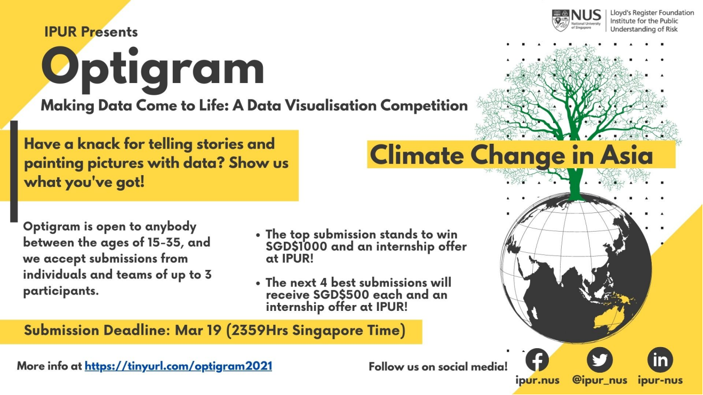
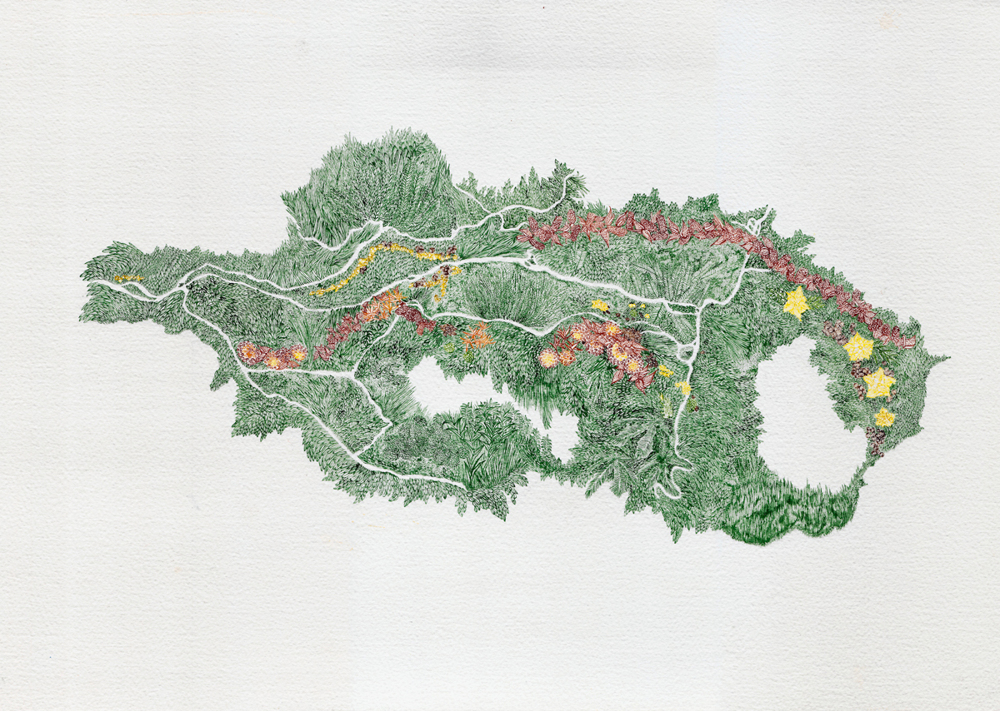
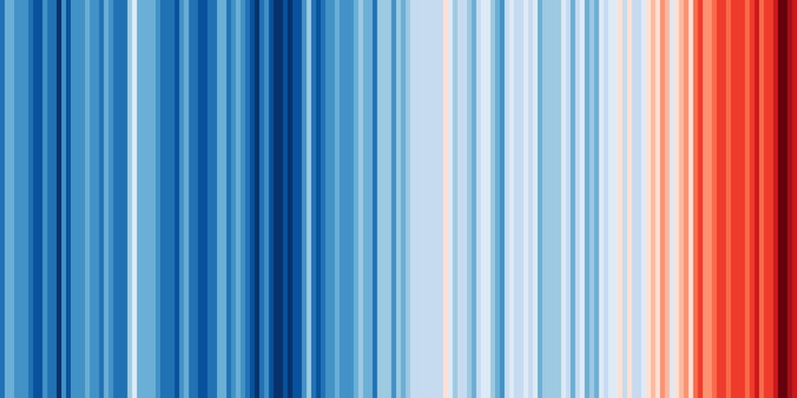
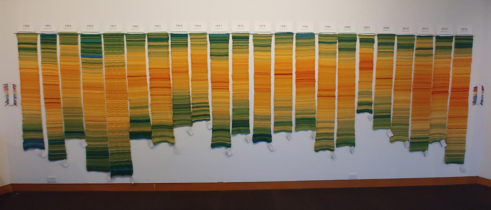

A blogpost for early career professionals in risk and resilience, cross posted with Lloyd’s Register Foundation Institute for the Public Understanding of Risk who is currently running the 2021 Optigram Data Visualization Competition on Climate Change in Asia

If you’re reading this blog post, chances are that you are 1) an early career risk professional and 2) considering whether you should learn more about data visualization. This blog is meant to provide three reasons why you should, from a fellow early career risk professional who started out the journey herself a few years ago.

If you don’t fall into one of these two categories, no worries, hopefully this guide will still be helpful for you, read on.

 

## Who is an early career professional in risk and resilience?

This is a very good question. There are two parts to this answer. First, what is risk and resilience? Second, what is early career?

Let’s start with the “easier” of the two—what is risk? Risk is generally thought of as the probability of a consequence occurring to a system of interest when it is exposed to a hazard. A simple example would be the probability of increased travel times (the consequence) to a transportation network (the system) when a hurricane occurs (the hazard). Risk can also be defined as uncertainty of outcome, and can be used in the context of measuring the probability of positive outcomes as well as negative outcomes. It is dynamically changing over time, especially as humans settle and densify in hazard-prone regions and as the frequency of environmental hazards increase with climate change. Resilience is related to risk, but captures our systems’ abilities to adapt and recover to these risks. A silver lining, though, is that we have more potential to understand our risk because of the increasing availability of data and measurements on its components, which in turn could inform actions that build resilience.

Now to the second question, what is early career? If you google “early career”, there are, of course, a google search’s worth of definitions. The most relevant definition focuses on the fact that those who are early in their career are building up their basic skills to perform their job 1. This is key. If you are early in your career, it’s likely that you are figuring out what your job even is and what those skills are that you need to build up. The good thing is, you have a bit of flexibility with your role—it’s the perfect time to be trying out new things. However, being young and wild and free is still a limited phase of your life, so it’s important to build up these skills strategically 2. So why should data visualization be a skill to include in your repertoire?

 

## Reasons to include data visualization in your skillset

Here are my top three reasons why you should learn about data visualization. Presented with alliteration, because, why not.

### 1. To communicate.

Potentially the most obvious reason to take up data visualization is to better communicate risk. Visualizing data in unique ways has the power to humanize data and make readers empathize with changes occurring in the world around them. Take for example, the Scrubland Map developed by the Fresh Flowers Collective in Colombia 3 . The creators used vegetation and flowers to represent risk, because “Like risk, the dispersal of foliage and flowers do not have a static pattern but rather obey the complexity of the territory.” Connecting risk with the native flowers of Colombia personalizes what is usually a stale risk map and makes it more enjoyable to take in from all viewers.

##### Scrubland Map by the Fresh Flowers Collective, originally exhibited in the Art of Resilience 3

Another set of prominent examples hail from climate scientist,   Ed Hawkins, who developed two viral climate-related graphics: the climate spiral 4 and the warming stripes 5. Both were quite simple, but allowed audiences to take in tons of data and extract meaning very quickly—the message was clear that the world is warming. Because of data visualization, his message was elevated to a much higher level than what a typical article, report, etc. would have received.

 

##### The Climate Spiral by Ed Hawkins, originally posted on Twitter

 

##### Warming Stripes by Ed Hawkins, originally posted on Twitter

 

### 2. To create.

If you are coming to risk from a technical or management side, it is likely that your most typical roles in this area might lack more playful forms of creativity. Sure, you can be creative in how you… develop a risk management strategy or put together a slide deck. But how often can you apply your creative self in your work? The self that you might have put aside many years ago when you decided you wanted to pursue a technical role instead of an artistic one. Data visualization provides an outlet for you to integrate your creative and technical selves. You could even merge what you thought of as a side hustle with your main hustle. Like to knit on the side? Why not create a mural of temperatures for where you live? The Tempestry Project made a beautiful piece that “seeks to bring the seemingly impossible climate change to a more manageable, intimate, and personal level” with their set of stitched tapestries 6. Data visualization can take many forms and be a perfect outlet to collaborate between the arts and sciences (see the Art of Resilience page for more examples: https://www.artofresilience.art/collaboration/).

##### Whidbey Island NAS by The Tempestry Project, originally exhibited at The Art of Resilience 6

 

### 3. To be critical

I’m not going to pick favorites here, but I think this reason is the most generally useful for all facets of your life. We are living in a data-laden world. From scientific reports to newspaper articles to hazard warnings, data and graphics are everywhere. Even though many people think of data as objective, the way it is presented is most definitely subjective. For example, people show confirmation bias, which is the tendency to look for things that support their viewpoint while ignoring conflicting information. Confirmation bias may cause people to find information that pushes their viewpoint in one direction, while ignoring contrary findings that lead to an entirely different conclusion. It is therefore important to learn graphicacy, or the ability to understand and present information in visual form 7. Two things most useful to understand is that whoever made a piece had their own bias in making it (that they want to share with you) and also that it is possible to misrepresent data. Understanding how to read graphs is not intuitive for everyone, but given the prevalence of graphs, should be almost as important as reading itself8. If anything, learning how to visualize data will build that sense of graphicacy as you make design decision

 

## Okay you’ve convinced me, how do I start?

There are plenty of ways to start getting into data visualization. First, I would think about what you are truly passionate about, what you have data on, and how you’d like to visualize. The how can range from very technical tools like Mapbox (like this story I made here), to excel (see Felipe’s example here) to knitting (like mentioned above). Knowing these constraints can help you find inspiration from other data pieces that exist.

Beyond inner reflection, there are many resources online that can help you get started. The Data Visualization Society has pulled together a bunch of resources on their website from the data visualization community: https://www.datavisualizationsociety.com/resources. There are also plenty of open tools, like DataBASIC, which can help you get started with working with data in the first place: https://databasic.io/en/.

Reading isn’t your jam? There are podcasts out there too like Data Stories (https://datastori.es/) or Policy Viz (https://policyviz.com/podcast/).

And finally, sign up for a challenge, a class, or experience! These will give you a reason to motivate you to build your skills. IPUR’s Optigram data visualization competition is geared towards you early career folks (age 15 to 35) to develop your own idea which merges scientific data and digital media to communicate risk. Another option is the Risk & Resilience DAT/Artathon, where yours truly hosts a virtual workshop which brings together early career folks from around the world to teach each other visualization skills and work on individual projects. Some of the final projects from the 2020 DAT/Artathon can be found in our gallery.

 

#### References

https://work.chron.com/definition-early-midcareer-17385.html ↩

Jay, M. (2012). The defining decade: why your twenties matter and how to make the most of them now. New York: Twelve. ↩

Fresh Flowers Collective. Scrubland. 2019, the Art of Resilience. https://www.artofresilience.art/gallery/scrubland-map/ ↩ ↩2

Hawkins, Ed. The Climate Spiral. 2016. https://en.wikipedia.org/wiki/Climate_spiral ↩

Hawkins, Ed. Warming Stripes. 2018. https://en.wikipedia.org/wiki/Warming_stripes ↩

The Tempestry Project, Whidbey Island NAS. 2018, the Art of Resilience. https://www.artofresilience.art/gallery/whidbey-island-nas/ ↩ ↩2

https://en.wikipedia.org/wiki/Graphicacy ↩

Cairo A (2017) Uncertainty and graphicacy : How should statisticians, journalists, and designers reveal uncertainty in graphics for public consumption? Available at: https://powerfromstatistics.eu/outlook-report. ↩
