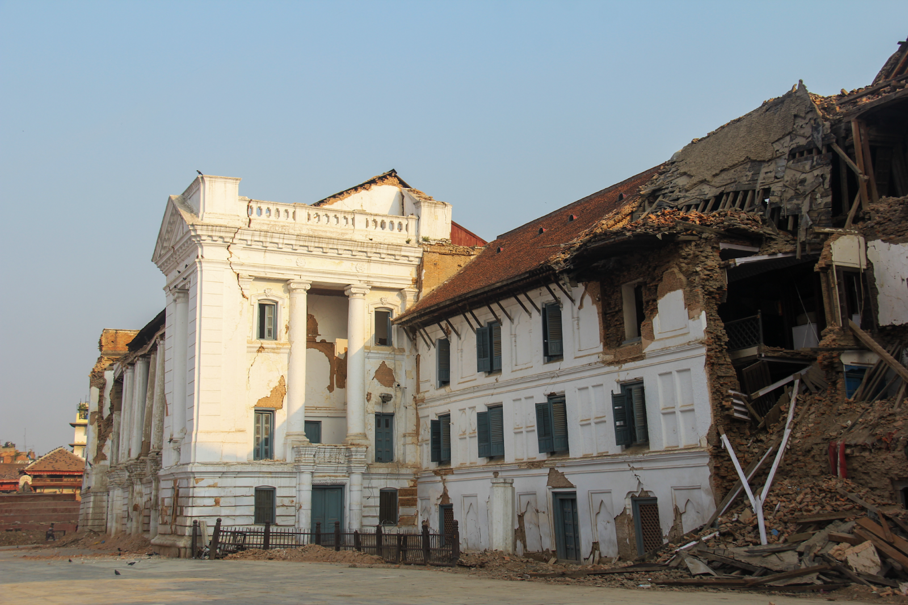

    <!-- Not totally sure why the public paths are failing the build rn. Todo. -->
    

For years, international agencies have been effusing the benefits of [big data for sustainable development](https://www.un.org/en/global-issues/big-data-for-sustainable-development). Emerging technology–such as crowdsourcing, satellite imagery, and machine learning–have the power to better inform decision-making, especially those that support the [17 Sustainable Development Goals](https://www.un.org./sustainabledevelopment/sustainable-development-goals/). When a disaster occurs, overwhelming amounts of big data from emerging technology are produced with the intention to support disaster responders. We are seeing this now with the recent earthquakes in Turkey and Syria: [space agencies are processing satellite imagery to map faults and building damage](https://maps.disasters.nasa.gov/arcgis/apps/MinimalGallery/index.html?appid=cb116456d682456abc38b90d96a72713) or [digital humanitarians are crowdsourcing baseline data like roads and buildings](https://tasks.hotosm.org/projects/14232#description). 

Eight years ago, the Nepal 2015 earthquake was no exception–emergency managers received [maps of shaking](https://earthquake.usgs.gov/earthquakes/eventpage/us20002926/map) or [crowdsourced maps of affected people’s needs](https://youtu.be/3y5AHs08Csc) from diverse sources. A year later, I began research with a team of folks involved during the response to the earthquake, and I was determined to understand how big data produced after disasters was connected to the long-term effects of the earthquake. Our research team found that this data overwhelmingly focused on building damage, which was often used as a proxy for population needs. Building damage information is useful but does not capture the full array of social, environmental, and physical factors that will lead to disparities in long-term recovery. I assumed information would have been available immediately after the earthquake that was aimed at supporting vulnerable populations. However, as I spent time in Nepal during the years after the 2015 earthquake, speaking with government officials and nongovernmental organizations involved in the response and recovery, I found they had lacked key information about the needs of the most vulnerable households–those who would face the greatest obstacles during the recovery from the earthquake. While governmental and nongovernmental actors prioritized the needs of vulnerable households as best as possible with the information available, I was inspired to pursue research that could provide better information more quickly after an earthquake, to inform recovery efforts.

<em> Kathmandu Durbar Square, May 2015 (credit: David Lallemant) </em>

In our [paper published in Communications Earth and Environment ](https://www.nature.com/articles/s43247-023-00699-4), we develop a data-driven approach to rapidly estimate which areas are likely to fall behind during recovery due to physical, environmental, and social obstacles. This approach leverages survey data on recovery progress combined with geospatial datasets that would be readily available after an event that represent factors expected to impede recovery. To identify communities with . . .

<Link is-button to="https://earthenvironmentcommunity.nature.com/posts/big-data-for-whom-data-driven-estimates-to-prioritize-the-recovery-needs-of-vulnerable-populations-after-a-disaster"> Read the full blog post here </Link>