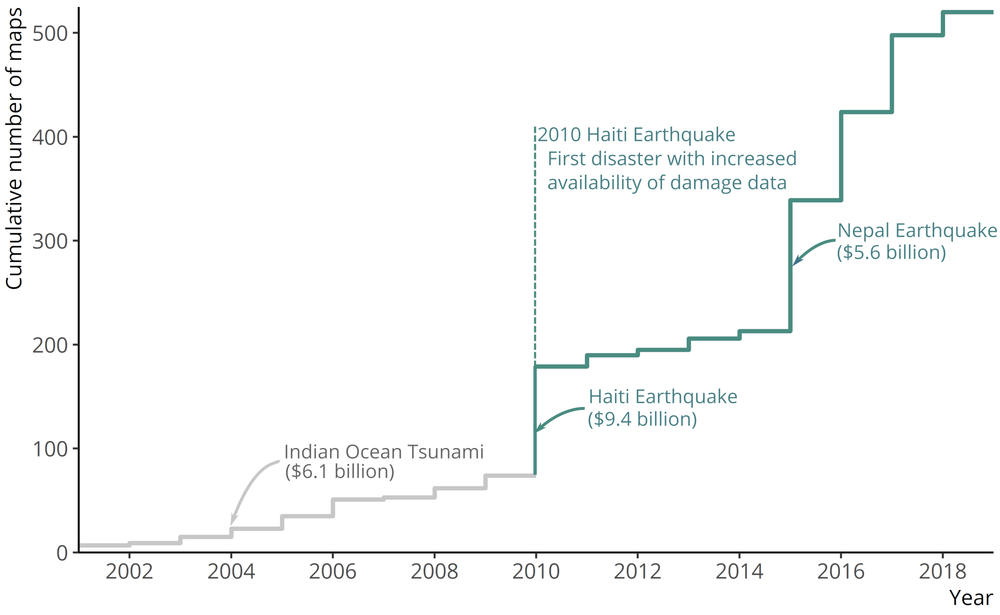

<Link is-button to="https://drive.google.com/file/d/10QQAkBe1oaiMys8Nc0su0LT7vBxpyQWq/view"> Read the full article here </Link>

 

### Abstract

While unprecedented amounts of building damage data are now produced after earthquakes, stakeholders do not have a systematic method to synthesize and evaluate damage information, thus leaving many datasets unused. We propose a Geospa-tial Data Integration Framework (G-DIF) that employs regression kriging to combine a sparse sample of accurate field surveys with spatially exhaustive, though uncertain , damage data from forecasts or remote sensing. The framework can be implemented after an earthquake to produce a spatially-distributed estimate of damage and, importantly, its uncertainty. An example application with real data collected after the 2015 Nepal earthquake illustrates how regression kriging can combine a diversity of datasets-and downweight uninformative sources-reflecting its ability to accommodate context-specific variations in data type and quality. Through a sensitivity analysis on the number of field surveys, we demonstrate that with only a few surveys, this method can provide more accurate results than a standard engineering forecast.

### Introduction

From rapid engineering forecasts to crowdsourced maps, unprecedented amounts of building
damage data are now being produced after earthquakes. The 2010 Haiti earthquake was the
first time that response and recovery stakeholders had access to this amount of damage data,
due to both technological advancements in remote sensing data acquisition and mandates to
make that data openly available after major disasters (Corbane et al., 2011; Kerle and Hoffman,
2013). In fact, after 2010 there was a spike in the number of damage-related maps posted on
ReliefWeb—a global information sharing site devoted to humanitarian disasters—in response to 
major earthquakes despite having similar estimated economic damages as earlier events (Figure
1).

<em> Figure 1. The number of damage-related maps posted on ReliefWeb, a disaster information sharing site, has increased since the 2010 Haiti earthquake. We would expect a similar number of maps for major events with similar estimated economic damages (shown in 2019 USD). The number of maps were scraped from ReliefWeb and economic damages were retrieved from EM-DAT (United Nations Office for the Coordination of Humanitarian Affairs, 2019; Universit´e catholique de Louvain (UCL) CRED and Guha-Sapir)</em>

 Counterintuitively, the increase in data is problematic since stakeholders–such as affected governments, multilateral donor organizations, and humanitarian organizations–receive a bar- rage of information and maps with unverified competing damage estimates (Kerle, 2013). Often, data from new and untested methods are left unused when decisions need to be made quickly (Hunt and Specht, 2019). Stakeholders do not have a systematic method to quickly assess the accuracy or synthesize these data sources. Furthermore, it is common for damage to be quantified using metrics that are not usable for stakeholders to make crucial decisions within weeks of an earthquake (Bhattacharjee et al., 2018). For example, in as little as two weeks, the affected government uses damage data to estimate total losses for the Post Disaster Needs Assessments (PDNA) to request recovery aid. It is unclear how to 1) translate multiple remotely-sensed damage maps that show damage intensity per pixel, like the maps shown in Kerle and Hoffman (2013), to usable metrics to estimate loss and 2) know which map is most accurate. If damage estimates are inaccurate in the PDNA, the affected government could under or overestimate the amount of aid requested—and subsequently distributed—for recovery. Because of these issues, many damage data are left unused. This paper outlines a Geospatial Data Integration Frame- work (G-DIF) to systematically integrate multiple sources of damage data into a single spatially distributed estimate of damage with quantified uncertainty to ease decision-making and improve the accuracy of post-earthquake damage estimates.

Integrating post-earthquake damage data is challenging since they are produced at differ- ent times with varying geospatial coverages, formats, and levels of uncertainty. While a few research studies have attempted to improve the accuracy of remote sensing and crowdsourced damage data, none have developed generalized methods to combine multiple data sources into a single, high-resolution, and spatially distributed estimate of building damage. For example, Booth et al. (2011) used Bayesian analysis to update the ratio of collapsed buildings in an af- fected area from manual assessments of satellite imagery with additional satellite assessments and field surveys after the 2010 Haiti earthquake but produced collapse probability distributions for four low-resolution land-use classes rather than high-resolution spatial estimates. Alterna- tively, some studies treat post-earthquake damage data as inputs and validation for vulnerability curves within an engineering forecast (e.g. Gunasekera et al., 2018; Huyck, 2015), but do not update the final damage estimate itself. Rather than estimating damage, some studies have used multiple damage data to develop maps of shaking intensity (e.g. Monfort et al., 2019). Finally, Lallemant and Kiremidjian (2013) applied cokriging to integrate a crowdsourced assessment with a set of field surveys, but this method was not generalized to incorporate multiple damage data sources.

As opposed to existing methods, which rely on only one to two damage datasets, we pro- pose a framework that is able to integrate multiple heterogeneous data sources to produce a single spatial damage prediction in the weeks after an earthquake. Specifically, the geostatis- tical model, regression kriging, implemented in G-DIF requires a limited sample of primary damage data from field surveys, which are accurate but have low spatial coverage, to predict damage using secondary damage data, which have lower accuracy but higher spatial coverage. Within this framework, we employ a geostatistical integration method, since damage between nearby buildings are likely correlated within the range of spatial correlation of ground motion because of similarities in construction age and material, local soil conditions, and multiple other factors (Shome et al., 2012). By modeling this spatial correlation parametrically, G-DIF does not rely on large field survey samples as training data, unlike most machine learning models.

Therefore, instead of relying on a model that is built with training data from one location and may not transfer well between different built environments and different data sources, G-DIF can be be developed after an event using its specific data, leading to locally calibrated damage estimates. Because of these features, similar geostatistical techniques have been previously ap- plied to integrate data in other fields such as for mapping atmospheric optical thickness (e.g. Chatterjee et al., 2010) and soil properties (e.g. Hengl et al., 2004; Thompson et al., 2010).

In this paper, we illustrate the implementation of the framework with an example application using real damage data collected after the 2015 Nepal Earthquake. In this example, we show how G-DIF produces a single map of damage and a map of the estimation uncertainty, which can be used to model economic losses and guide further field surveying, respectively. Compared to traditional methods of rapidly estimating post-earthquake damage, G-DIF results in a damage estimate with lower overall error, higher resolution, and is specific to each context.

<Link is-button to="https://drive.google.com/file/d/10QQAkBe1oaiMys8Nc0su0LT7vBxpyQWq/view"> Read More </Link>
