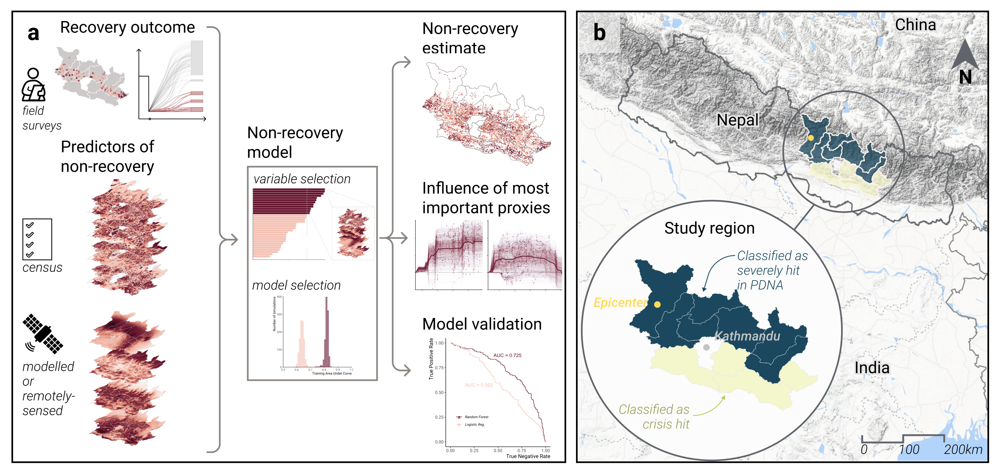

<Link is-button doOpenInNewTab to="https://www.nature.com/articles/s43247-023-00699-4"> Read the full article here </Link>

 
 

    <!-- Not totally sure why the public paths are failing the build rn. Todo. -->
    

### Abstract
Following a disaster, crucial decisions about recovery resources often prioritize immediate damage, partly due to a lack of detailed information on who will struggle to recover in the long term. Here, we develop a data-driven approach to provide rapid estimates of non-recovery, or areas with the potential to fall behind during recovery, by relating surveyed data on recovery progress with data that would be readily available in most countries. We demonstrate this approach for one dimension of recovery---housing reconstruction---analyzing data collected five years after the 2015 Nepal earthquake to identify a range of ongoing social and environmental vulnerabilities related to non-recovery in Nepal. If such information were available in 2015, it would have exposed regional differences in recovery potential due to these vulnerabilities. More generally, moving beyond damage data by estimating non-recovery focuses attention on those most vulnerable sooner after a disaster to better support holistic and nuanced decisions.

### 1. Introduction
Natural hazards often cause disproportionate impacts on vulnerable populations and amplify inequality for years after an event.
Among many examples, four times more women than men died in the 2004 Indian Ocean Tsunami, and multi-family, Hispanic, and linguistically-isolated households had inadequate access to loss-based assistance programs following the 1994 Northridge Earthquake.
When repeated examples of disaster-exacerbated inequality are evident over time, we must recognize that recovery policies, and the underlying information that supports them, fail to address and prevent deepening inequality.

Housing recovery policies are a powerful tool to prioritize vulnerable populations after an event.
Early decisions can shape the long-term recovery trajectory of an entire region, both positively and negatively. 
Currently, recovery assistance is not designed as a means of redistribution . 
For example, aid is based on losses (or damage) incurred to pre-disaster homes, therefore prioritizing those who had assets before the disaster.
Alternative needs-based, area-targeting,  or subsidiary approaches exist, where policies prioritize groups who may lack necessary resources  to support their own recovery.
However, the implementation of sustainable recovery approaches is challenging, partly due to a lack of timely information that prioritizes these communities and identifies factors that will impede their recovery in the weeks following a disaster when these plans are made.  

While it is clear that marginalized populations fall behind in recovery, few quantitative data exists in the hours to days after a disaster that explicitly acknowledges these inequities to better support more equitable and sustainable recovery approaches.
For example, even though the the Post-Disaster Needs Assessment (PDNA) was developed as a process to collaboratively rapidly evaluate human recovery needs to support government recovery efforts, quantification of disaster impacts still largely focuses on economically quantifiable damages rather than social needs.

 

<Link is-button doOpenInNewTab to="https://www.nature.com/articles/s43247-023-00699-4"> Read More </Link>
