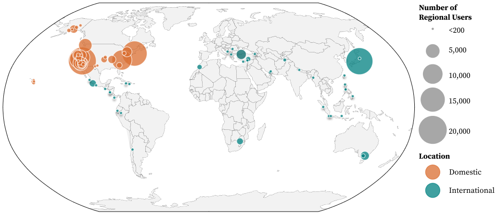
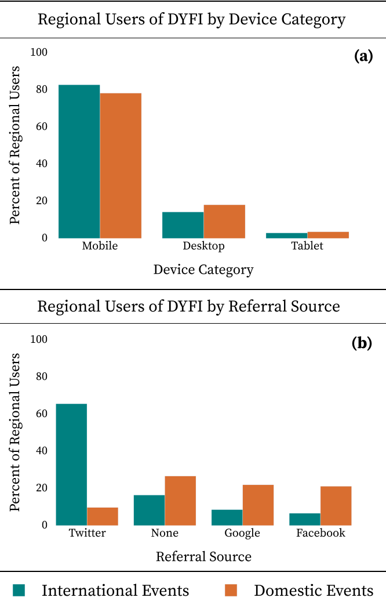
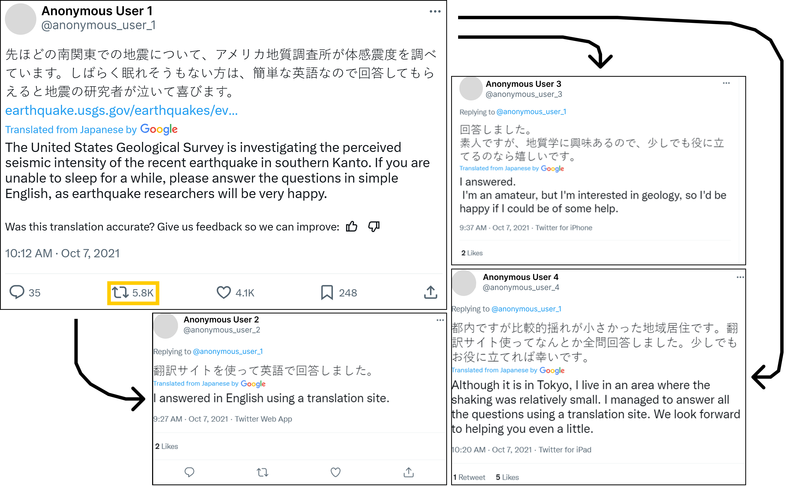
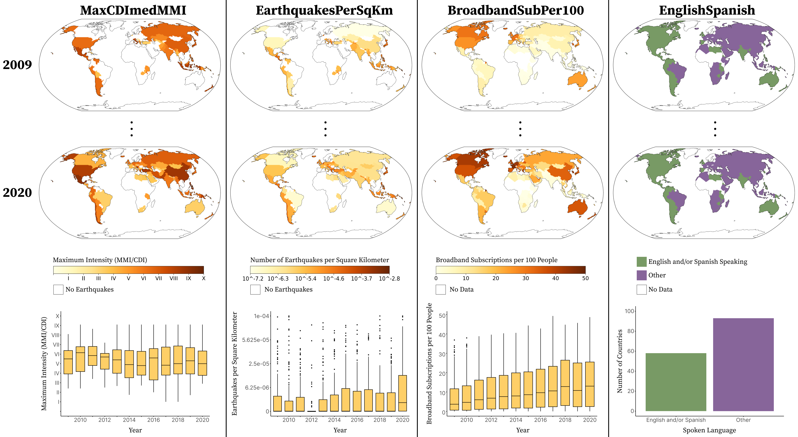
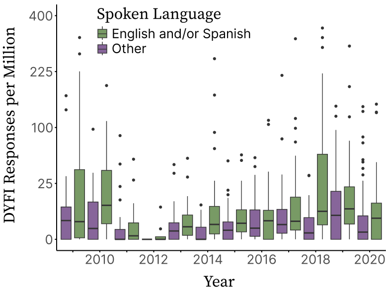
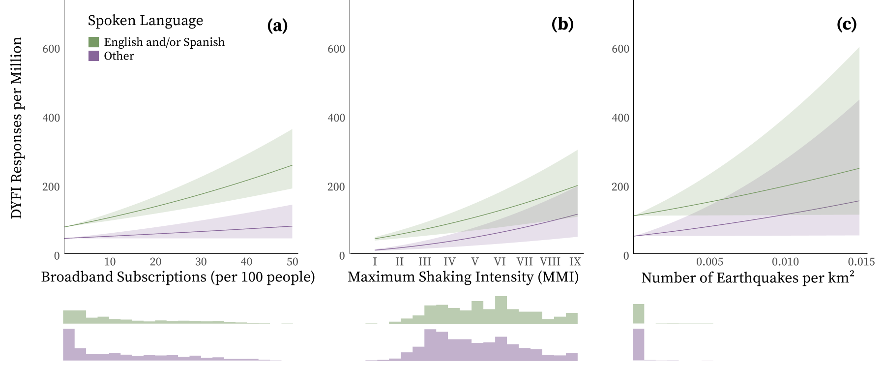
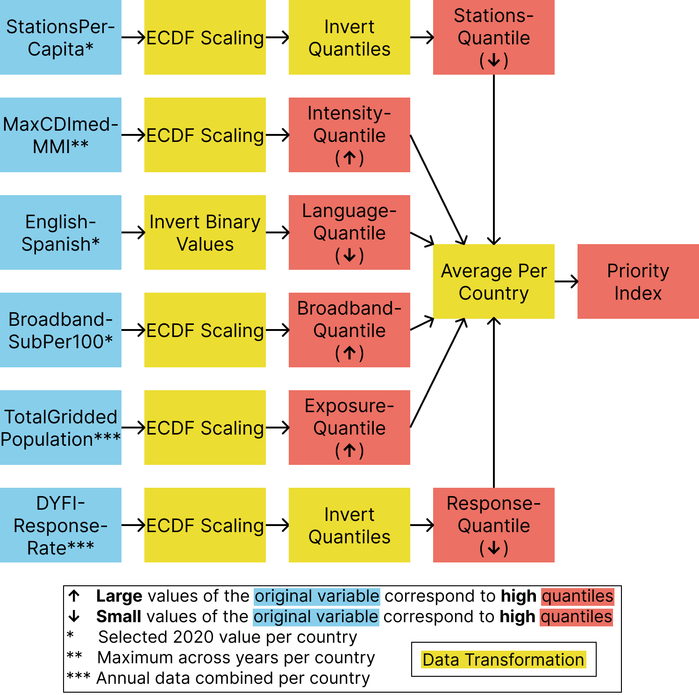
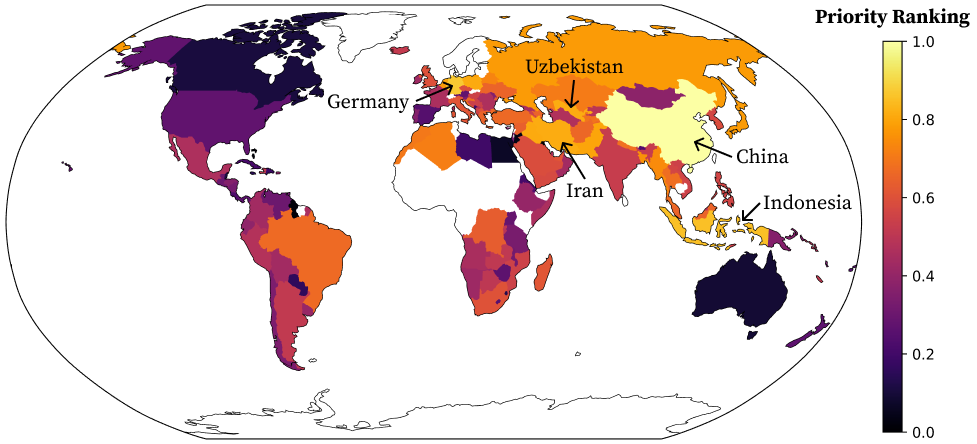

<Link is-button doOpenInNewTab to="https://doi.org/10.1785/0220250168"> View the journal-published version here </Link>

---

 

## Open Access Version

This material may be downloaded for personal use only. Any other use requires prior permission of Seismological Research Letters.

<iframe src="/files/Knodel_et_al_2025_Global_DYFI_Analysis_AIDD.pdf" width="100%" height="600px"></iframe>

<a href="/files/Knodel_et_al_2025_Global_DYFI_Analysis_AIDD.pdf" download class="btn">
  Download PDF
</a>

### Abstract
The U.S. Geological Survey’s (USGS) “Did You Feel It?” (DYFI) system is an internet tool
that collects shaking intensity observations through crowdsourcing. It produces maps
and provides supplementary data to ShakeMap, which offers near-real-time maps of
ground motion resulting from significant earthquakes around the globe. Barriers such
as technology and language make DYFI an unequally accessible tool, however, leading
to a less comprehensive view of an earthquake’s impact in certain regions. Here, we
analyze users’ global interaction with DYFI to evaluate its accessibility. We employ
web analytics to quantify how users access DYFI, and perform inference modeling
to predict each country’s response rate to DYFI. The panel dataset built for this inference
model combines physical earthquake parameters from the USGS with socioeconomic
data from the World Bank and the Central Intelligence Agency for 151 countries from
2009 to 2020. Our web analytics show that users predominantly access DYFI through
mobile devices and are often referred through social media. In addition, results from the
inference model reveal that socioeconomic parameters, including primary language
spoken and broadband internet subscriptions, alongside physical earthquake parameters such as average shaking intensity, have a significant effect on a country’s response
rate to DYFI. As a result of this analysis, we establish a country priority index for
improved DYFI awareness and accessibility. This index considers regions of the world
lacking seismic station coverage that face barriers to DYFI access, such as language,
technology, and other factors. Consequently, the USGS has made evaluating DYFI’s performance on mobile devices a priority and has begun incorporating and monitoring the
use of additional languages within the DYFI system. Furthermore, our analyses suggest
specific nations with low response rates could benefit from targeted outreach in conjunction with partner agencies in each country.

 

### Figure 1

    

Web traffic data were analyzed for 80 earthquakes. Locations and number of regional users for earthquakes from 2019 to 2023 used in web traffic analysis.

### Figure 2

    

Earthquake-affected populations (regional users) physically and digitally access “Did You Feel It?” (DYFI) through different means. Bar charts show the number of regional users that access an event’s Felt Report page by (a) device category and (b) referral source aggregated across 40 domestic events (orange) and 40 international events (teal). Only the four most common referral sources are shown (b). The 2021 Mw 5.9 Chiba, Japan, accounts for 63% of all international regional users. 

### Figure 3

    

Social media can significantly increase DYFI interaction. Social media interactions surrounding “Did You Feel It?” and the 2021 Mw 5.9 Chiba, Japan, earthquake. Arrows point from the original tweet to responses to that tweet. 

### Figure 4

    

DYFI response rates over time. Grid of maps visualize response rate to DYFI for each year in the dataset (2009–2020). Response rates are transformed on a log scale and presented as DYFI responses per million people exposed to shaking. Countries are colored gray if they experienced earthquakes but had zero responses to DYFI for the year.

### Figure 5

    

Explanatory variables over time. Grid of maps and charts visualize a subset of explanatory variables over time. Each column visualizes a different variable in the dataset: (a) MaxCDImedMMI, (b) EarthquakesPerSqKm (on a log scale), (c) BroadbandSubPer100, and (d) EnglishSpanish. These are the independent variables in the final statistical inference model. The first two rows show the spatial distribution of each variable for the first (2009) and last (2020) years of the compiled dataset. Intermediate years are not shown. The bottom row shows the temporal or categorical distribution of each variable. Each box in the box plot describes the variable’s distribution across all 151 countries in a given year. Box plots for EarthquakesPerSqKm and BroadbandSubPer100 have upper limits of 1 × 10−4 and 50, respectively, for visualization purposes. Missing values are not visualized. A bar chart is used for EnglishSpanish, because it is constant over time. 

### Figure 6

    

English- and Spanish-speaking countries tend to have higher DYFI response rates. Temporal box plots of response rate by country spoken language. For illustrative purposes, response rates are capped at 400 responses per million people exposed to shaking, and missing values are excluded from the visualization.

### Figure 7

    

Individual variable impacts on DYFI response rate. Line plots with confidence bounds visualize the modeled relationship between quantitative explanatory variables and DYFI response rate, by country’s spoken language, while holding all other variables constant (at their mean value). Quantitative explanatory variables plotted are Broadband Subscriptions (a), Shaking Intensity (b), and Earthquake Density (c). Based on 100 bootstrapped samples, the lines correspond to the median coefficients, and the bounds reflect a 95% confidence interval derived from the same bootstrapping process. Response rate values were calculated using Equations 3-7. Below the plots are histograms of explanatory variables by country spoken language, including data from all years (2009–2020).

### Figure 8

    

Calculating the country priority index. The diagram flows left to right, starting with input variables, transforming them into country quantiles, and averaging quantiles to create the priority index. Empirical cumulative distribution function (ECDF) scaling involves constructing an ECDF to assign country quantiles for each variable. For further details on the priority index calculation, see Figure 12.

### Figure 9

    

Mapped results of the composite priority index. Countries with the highest priority for improved DYFI accessibility are labeled. White-colored countries had no recorded earthquakes from 2009 to 2020.

 

<Link is-button doOpenInNewTab to="https://doi.org/10.1785/0220250168"> Read the journal-published version </Link>

