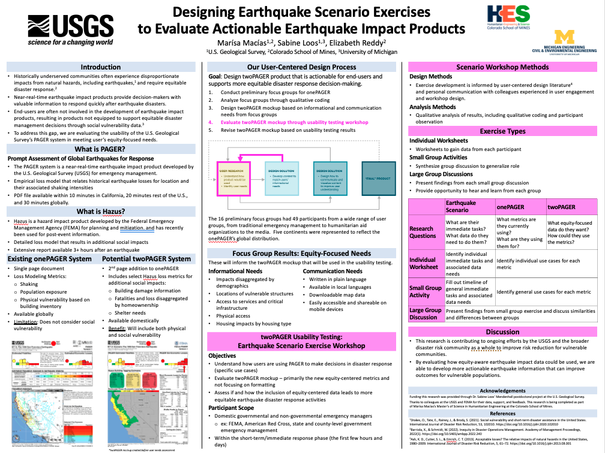

## Summary 

**AIDD labs member, [Marísa Macías](http://disasterdata.engin.umich.edu/team/marisa-macias), won 1st place at the Colorado School of Mines Graduate Research Symposium for this poster**

Natural hazards of all kinds often disproportionately impact underserved communities, and earthquakes are no different. To address these disproportionate impacts during the immediate response, underserved communities need and deserve emergency management efforts that are explicitly focused on equity. However, responders often do not have post-earthquake information that reveals disproportionate impacts. While preliminary research suggests that such tools may be useful, their functionality needs to be assessed.

In this study, we are learning about the needs of professional users of earthquake impact products through a user-centered, iterative design process. Initial focus groups with users allowed us to develop a mockup for a new impact product highlighting social vulnerability characteristics in a way that focuses on user needs through considering a current product, the U.S. Geological Survey’s PAGER (Prompt Assessment of Global Earthquakes for Response). We are now developing earthquake scenario exercises to gain feedback on the mockup. Using historical earthquakes as our scenarios, we will present professional users with our mockup as the product inject in this specific earthquake disaster as it relates to equitable disaster response through a workshop-based tabletop exercise. Through qualitative analysis, we will then apply the results of the scenario exercise to our prototype as the next product iteration. We seek to explore what formatting might be most effective, how users might use the content, and how social vulnerability content influences their decision-making to support equitable considerations.

<Link is-button doOpenInNewTab to="https://drive.google.com/file/d/151SnqWl2EAYKSbhw1LAGh_5wRditJqio/view?usp=sharing"> Download Poster </Link>
