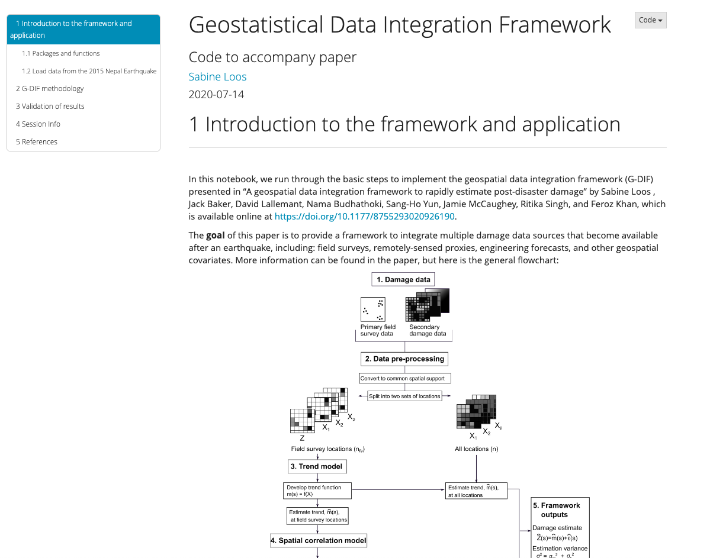

We created an interactive R notebook to accompany our article “G-DIF: A Geospatial Data Integration Framework to Rapidly Estimate Post-Earthquake Damage” published in Earthquake Spectra in 2020 (find that article <Link doOpenInNewTab to="gdif-nepal"> here </Link>).

<Link is-button doOpenInNewTab to="https://sabineloos.github.io/GDIF-damageprediction/GDIF_nb.html"> Interactive Code </Link>

The source code and some of the data used to produce this notebook is located in a Github repository. This code applies the geospatial data integration framework (G-DIF) to data from the 2015 Nepal Earthquake in order to replicate key results from the journal article.

<Link is-button doOpenInNewTab to="https://github.com/sabineloos/GDIF-damageprediction"> Github Repository </Link>