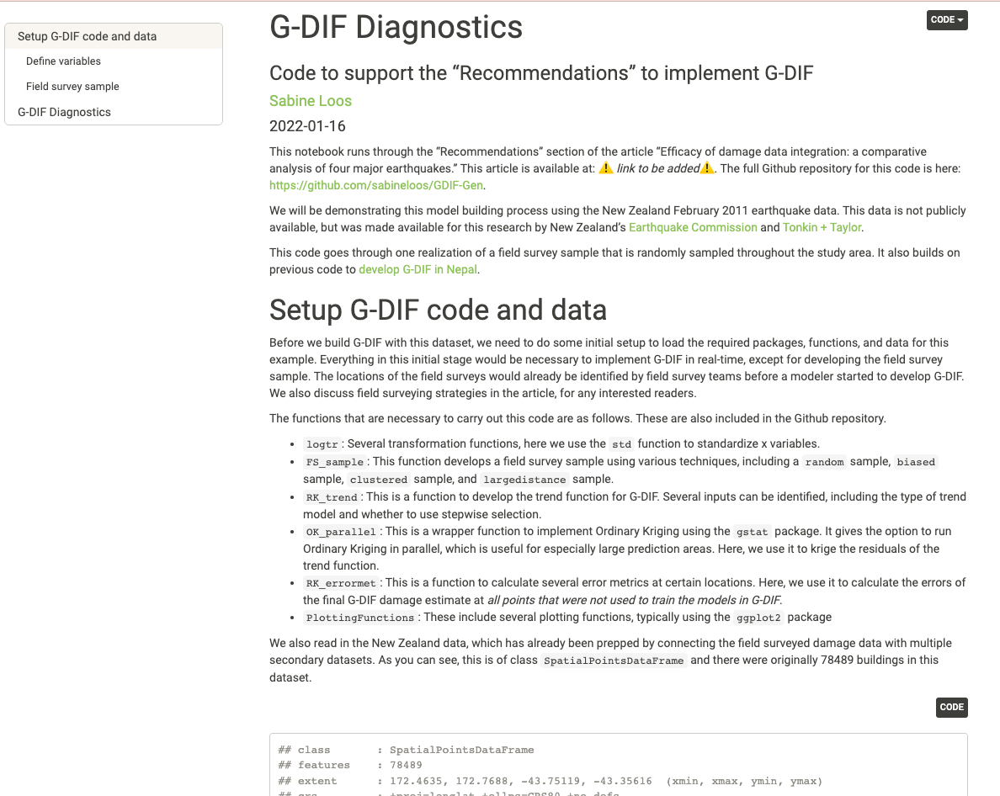

We created an interactive R notebook to accompany the Recommendations section of our article “Efficacy of Damage Data Integration: A Comparative Analysis of Four Major Earthquakes” published in Natural Hazards Review in 2022 (find that article <Link doOpenInNewTab to="gdif-efficacy"> here </Link>).

<Link is-button doOpenInNewTab to="https://sabineloos.github.io/GDIF-Gen/Diagnostics.html"> Interactive Code </Link>

The source code and some of the data used to produce this notebook is located in a Github repository. The main script in this repository is Diagnostics.Rmd in the /code folder. This produces the interactive script that mainly supports the "Recommendations" section of the above paper. Unfortunately, due to data privacy requirements, we are unable to share the data that was used to develop this code. However, if you are interested in running this with your own data, please contact me. In the interactive script, you will still be able to see all the results from running this Diagnostics.Rmd file with the input data. You also have access to all the necessary functions to run this code.

<Link is-button doOpenInNewTab to="https://github.com/sabineloos/GDIF-Gen/tree/main"> Github Repository </Link>