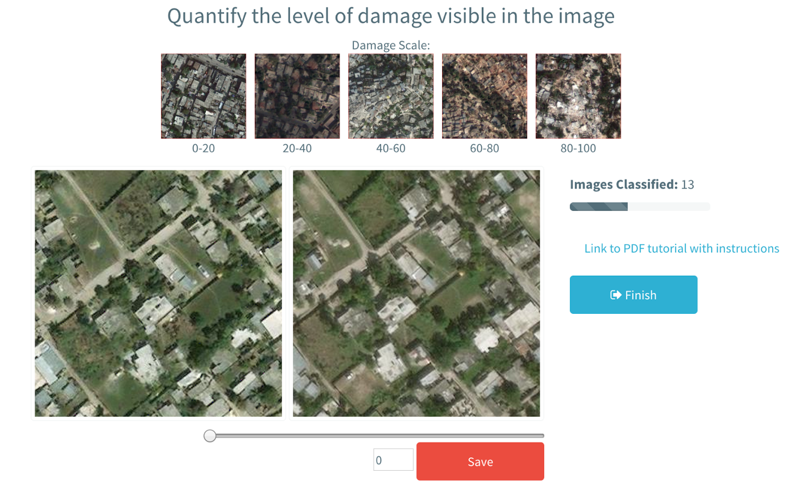

<Link is-button doOpenInNewTab to="https://purl.stanford.edu/bj915mt6570"> Read the full report here </Link>

 
 

    <!-- Not totally sure why the public paths are failing the build rn. Todo. -->
    

### Abstract
Crowdsourced analysis of satellite and aerial imagery has emerged as a new mechanism to assess post-disaster impact in the past decade. Compared to standard ground-based damage assessments, crowdsourcing initiatives rapidly process extensive data over a large spatial extent and can inform many important emergency response and recovery decisions. We test three approaches to crowdsourcing post-earthquake building damage using 50cm resolution satellite imagery from the 2010 Haiti earthquake. Approach 1 further develops the predominant building-level map-based assessment method that has been implemented in earlier crowdsourcing initiatives. Two novel area-based assessment approaches were also developed, where users rate the level of build-ing damage in an image (Approach 2) and compare building damage between two images (Approach 3). The results of the two area-based approaches show a trend between crowdsourced and true field damage severity, which can be improved by weighting high-performing volunteers. Alternative methods, including Bayesian updating and network analysis, are proposed to analyze the paired comparison data from Approach 3. However, Approach 1 did not reach completion, because of the time intensive nature of building-level assessments.

Parallel to the crowdsourcing tests, an extensive ’demand survey’ of interviews with post-disaster practitioners was conducted to develop a timeline of six key decisions that are dependent on post-earthquake building damage data. The resulting framework can guide future research concerning rapid damage estimates to address decision-makers’ specific, and cross-cutting needs. Considering the results of the crowdsourcing tests and the demand survey, area-based approaches are promising methods to crowdsource building damage, because of its user-simplicity and ability to address specific post-disaster decisions.

### Introduction
Earthquakes radically impact the natural, social, and built environments of affected regions. From the moment the earthquake is over, knowledge on the impact to buildings, specifically, facilitates response and recovery decisions made by local governments, international agencies, and non- governmental organizations. As an example, the coordination of urban search and rescue teams in the days following an event relies on information about the locations and severity of building damage and potential casualties. Another example are the post-disaster impact analyses carried out during the response and recovery phases by the locally affected government, with the aid of the United Nations, World Bank, and European Commission. These Post-Disaster Needs As- sessments (PDNA) aim at quantifying damages and losses to multiple economic sectors, with the housing sector often making up more than half of the total economic loss. Generally, these decisions are based on ad-hoc information obtained from whatever sources become available.

Numerous technological and organizational advances have made remotely sensed data rapidly available soon after an earthquake. Now, earth observation data, from satellite or aircraft sensors, are able to actually observe the regional impact of an earthquake over a large spatial scale within a relevant time-scale (Joyce 2016). Furthermore, the growth of “digital humanitarianism” has led to an increase in valuable information delivered by online communities after a crisis. Such commu- nities, including Humanitarian OpenStreetMap Team (HOT), Standby Task Force, and Tomnod, organize after a disaster to rapidly map relevant characteristics in affected areas for on-the-ground decision-makers. The combination of remote sensing data and digital humanitarianism thereby is an extraordinary opportunity to crowdsource the assessment of earthquake-induced building damage.

As opposed to field-based assessments of damage which take extensive amounts of time to cover the entire affected region, remote-sensing based observations can be produced within a couple of weeks. The Haiti 2010 earthquake is a remarkable example of the widespread usage of satellite imagery to rapidly map induced building damage, since the public access could access very high Earthquakes radically impact the natural, social, and built environments of affected regions. From the moment the earthquake is over, knowledge on the impact to buildings, specifically, facilitates response and recovery decisions made by local governments, international agencies, and non- governmental organizations. As an example, the coordination of urban search and rescue teams in the days following an event relies on information about the locations and severity of building damage and potential casualties. Another example are the post-disaster impact analyses carried out during the response and recovery phases by the locally affected government, with the aid of the United Nations, World Bank, and European Commission. These Post-Disaster Needs As- sessments (PDNA) aim at quantifying damages and losses to multiple economic sectors, with the housing sector often making up more than half of the total economic loss. Generally, these deci- sions are based on ad-hoc information obtained from whatever sources become available.
Numerous technological and organizational advances have made remotely sensed data rapidly available soon after an earthquake. Now, earth observation data, from satellite or aircraft sensors, are able to actually observe the regional impact of an earthquake over a large spatial scale within a relevant time-scale (Joyce 2016). Furthermore, the growth of “digital humanitarianism” has led to an increase in valuable information delivered by online communities after a crisis. Such commu- nities, including Humanitarian OpenStreetMap Team (HOT), Standby Task Force, and Tomnod, organize after a disaster to rapidly map relevant characteristics in affected areas for on-the-ground decision-makers. The combination of remote sensing data and digital humanitarianism thereby is an extraordinary opportunity to crowdsource the assessment of earthquake-induced building damage.
As opposed to field-based assessments of damage which take extensive amounts of time to cover the entire affected region, remote-sensing based observations can be produced within a couple of weeks. The Haiti 2010 earthquake is a remarkable example of the widespread usage of satellite imagery to rapidly map induced building damage, since the public access could access very high

<Link is-button doOpenInNewTab to="https://purl.stanford.edu/bj915mt6570"> Read the full report here </Link>
