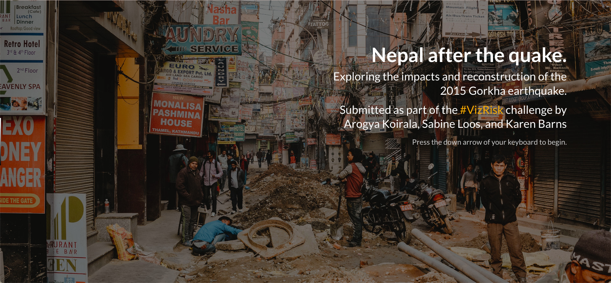
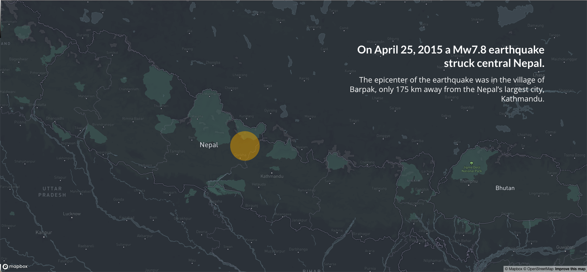

This visualization put together by Arogya Koirala, Sabine Loos, and Karen Barns looks at the impacts and recovery from the 2015 Nepal earthquake. It won [Best Visual Design](https://understandrisk.org/vizrisk-winners-and-submissions/) for the World Bank's and Mapbox's VizRisk Challenge.

You can read more about how this visualization was made in [this blog post](https://sabine-loos.com/blog-1/afterquake-visrisk).

    <!-- Not totally sure why the public paths are failing the build rn. Todo. -->
    

    <!-- Not totally sure why the public paths are failing the build rn. Todo. -->
    

<Link is-button doOpenInNewTab to="https://afterthequake.surge.sh/"> Explore the visualization here</Link>