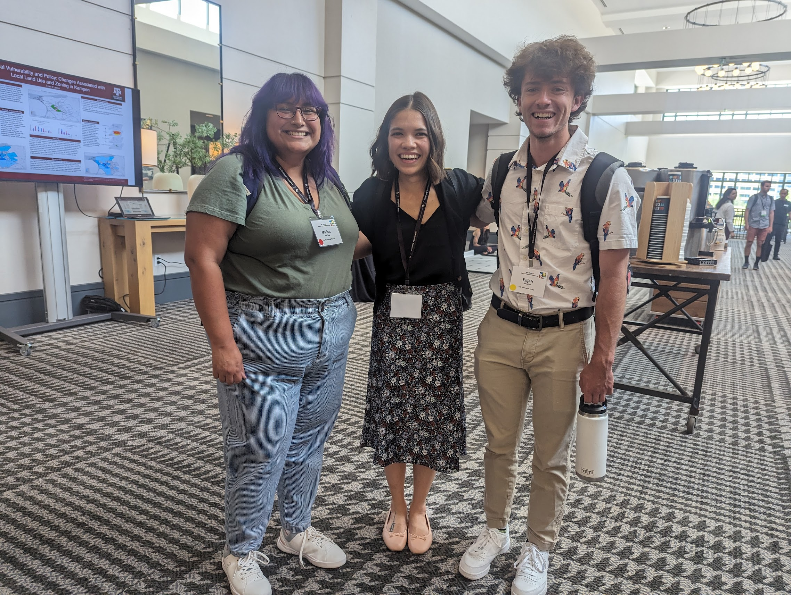
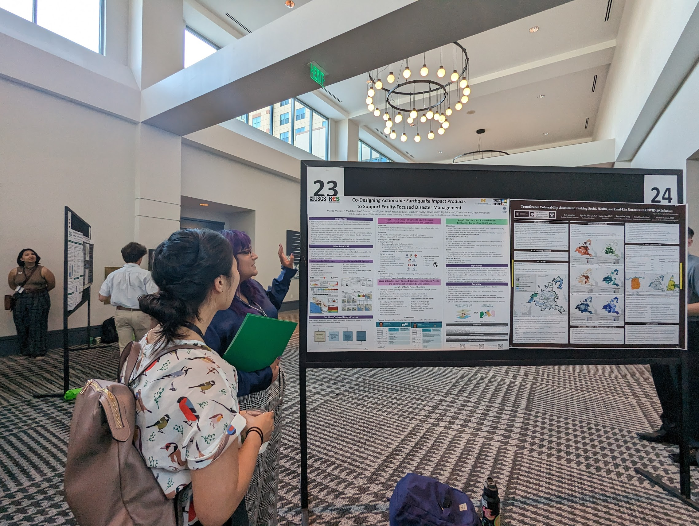
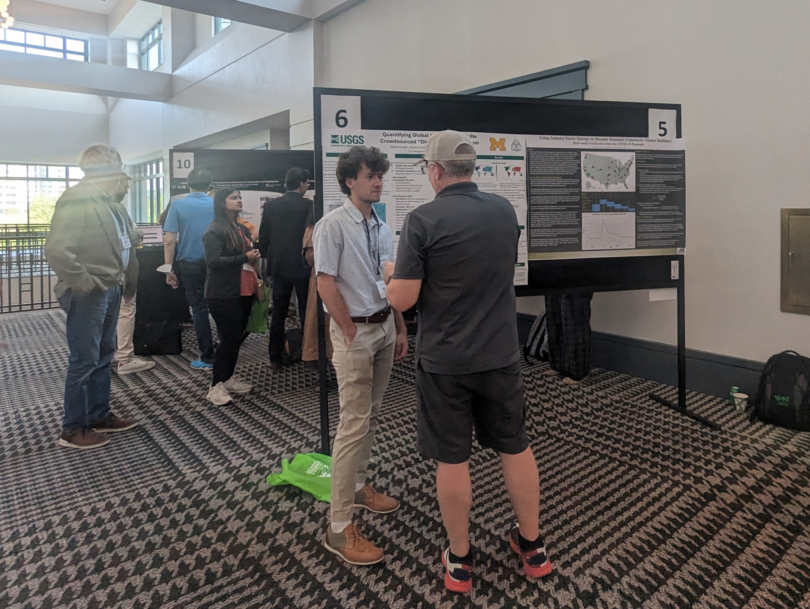

<em> Marísa, Sabine, and Eli at the Natural Hazards Workshop in between sessions</em>

Marísa presented on our work at the U.S. Geological Survey evaluating user needs for equity-focused earthquake information through an iterative human centered design process. Her presentation can be found [here](https://disasterdata.engin.umich.edu/content/macias-mines-symposium).

Eli presented on his work at the U.S. Geological Survey evaluating the accessibility of the Did You Feel It? earthquake products at USGS. His presentation can be found [here](https://disasterdata.engin.umich.edu/content/knodel-nhw-dyfi-poster).

Sabine presented on the Equity and Risk Working group.

