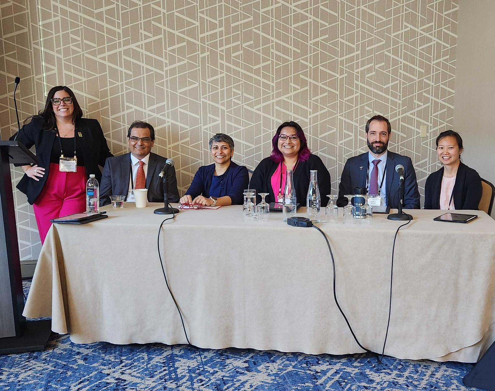

<em> The C-CIES panel at the 2024 EERI Annual Meeting. From L-R, Monica Alvillar, Aaron Velasco, Divya Chandrasekhar, Marísa Macías, Jeffrey Weidner, and Yolanda Lin.</em>

To learn more about our work on human centered design for earthquake information products at the U.S. Geological Survey, please stay updated with our project [here](http://disasterdata.engin.umich.edu/projects/codesign-equity-earthquakeinfo).

To learn more about the Center for Collective Impact in Earthquake Science (C-CIES), visit their website <Link doOpenInNewTab to="https://www.c-cies.org/"> here </Link>.