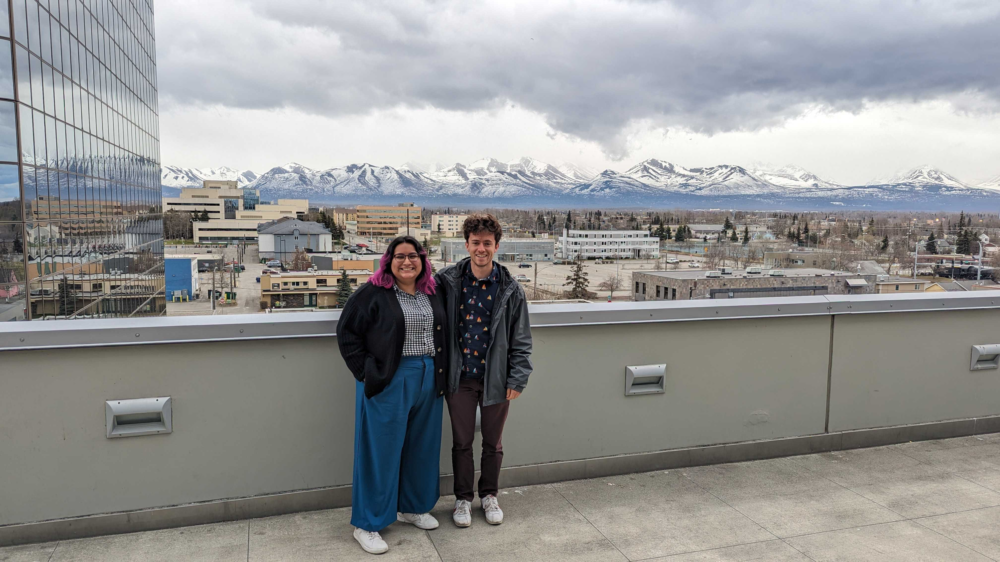
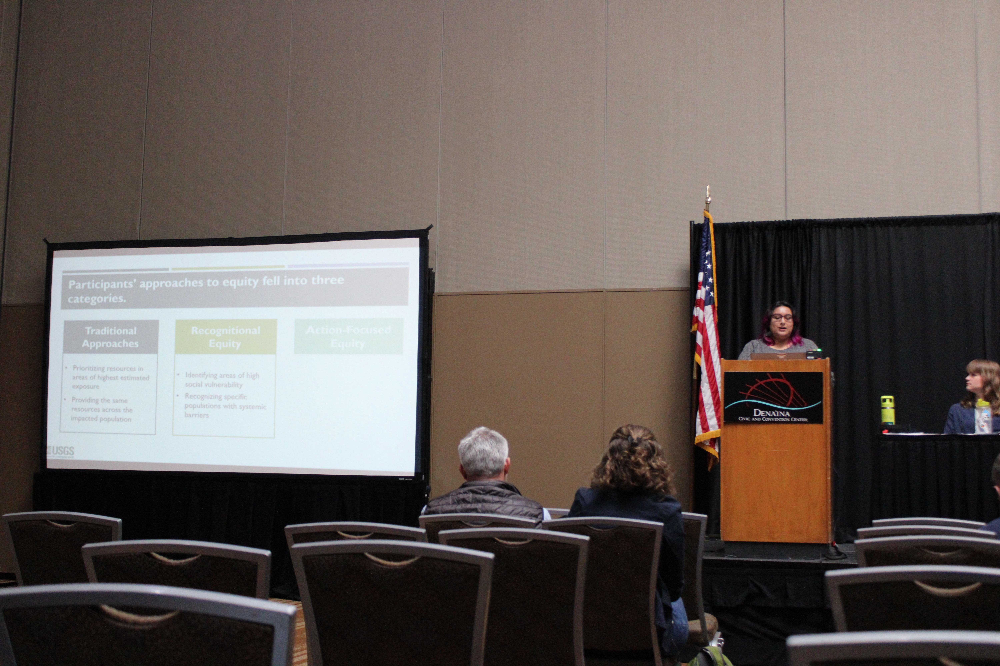
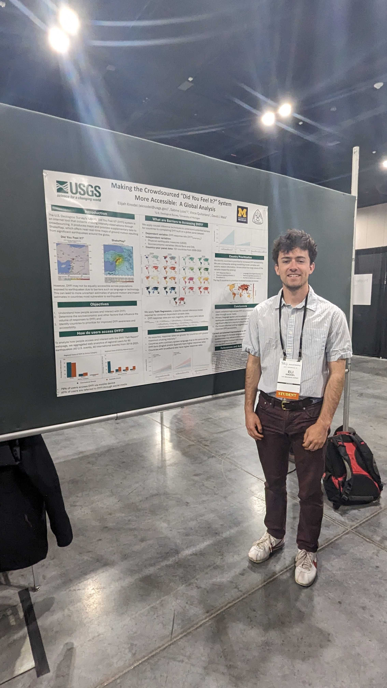
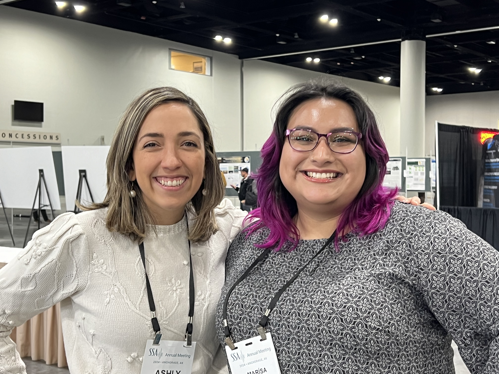

<em> Marísa and Eli attending the 2024 Seismological Society of America Meeting in Anchorage, Alaska.</em>

Several AIDD Lab projects were presented on at the [2024 Seismological Society of America (SSA) Meeting](https://meetings.seismosoc.org/) this year. 

Marísa convened a session on ''Creating Actionable Earthquake Information Products" with co-conveners David Wald (USGS), Tiegan Hobbs (Natural Resources Canada), and Sabine Loos. This session included many oral and poster presentations from multiple agencies and researchers around the world.

<em> Marísa presenting on approaches to equity seen in earthquake emergency management at the 2024 SSA Meeting.</em>

At this session, Marísa was also able to present on her Masters Thesis Research on ''Improving Earthquake Impact Data for Equity-Focused Emergency Management.'' To learn more about our work on human centered design for earthquake information products at the U.S. Geological Survey, please stay updated with our project [here](http://disasterdata.engin.umich.edu/projects/codesign-equity-earthquakeinfo). 

Also, Eli was able to present a finished global analysis of DYFI? Accessibility. To learn more on this project, please visit [here](https://disasterdata.engin.umich.edu/projects/dyfi-analysis)

<em> Eli presenting on the accessibility of DYFI? at the 2024 SSA Meeting.</em>

Finally, our group got to connect with several friends of AIDD Lab, including Dr. Ashly Cabas from North Carolina State University!

<em> Marisa meeting Dr. Ashly Cabas at the poster session of SSA!</em>
