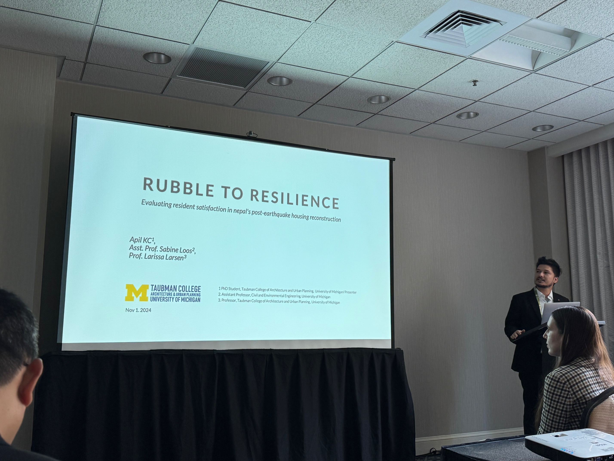

This study explores post-disaster housing recovery in Nepal, specifically in the districts of Kavre and Sindhupalchowk, based on findings from 35 in-depth interviews conducted in the summer of 2024. The field research was partially supported by the [Global Individual Grant](https://ii.umich.edu/ii/funding/iisf/global-individual-grants.html). 

<em> Photo: Apil presenting at ACSP in Seattle, November 2024. Photo credit: Kanako Iuchi.</em>

The presentation emphasized how recovery approaches must address economic disparities and promote technical flexibility to serve affected populations more equitably. The authors argue that adaptable policy implementation enables the construction of homes that meet local family needs, support livelihoods, and provide climate comfort—key factors influencing resident satisfaction. The presentation was well received, sparking discussions on equitable recovery practices in the session, which was moderated by Dr. Aysin Dedekorkut-Howes of Griffith University, Australia.