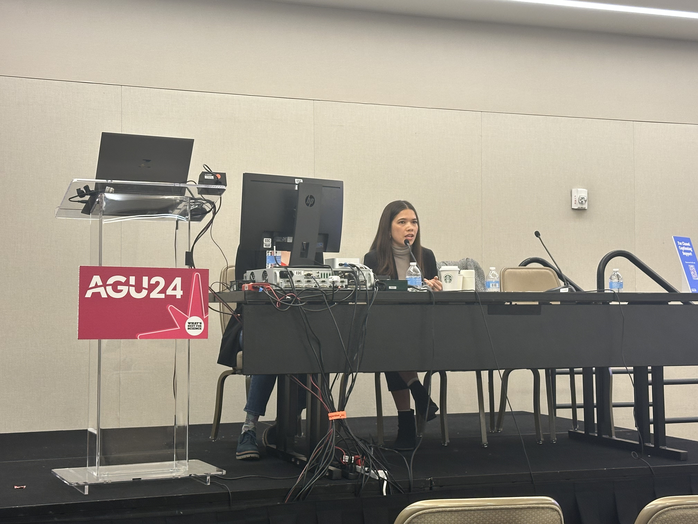
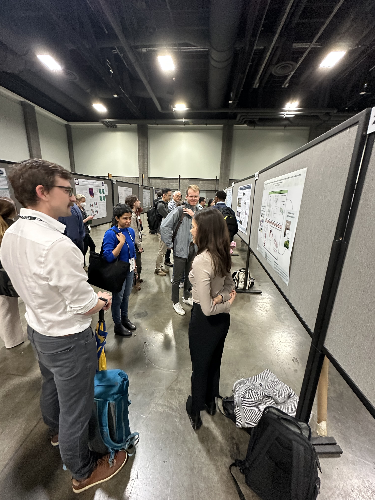

## 🌍 **Leadership and Contributions to Equity-Focused Sessions**
Prof. Loos played a key role in several sessions aimed at advancing equity and inclusion in disaster and climate risk assessments. Her contributions included:

### 1️⃣ **Organizing the "Elevating Equity: Shifting Climate and Disaster Risk Assessment for a Just Future" Poster and Oral Sessions** (Co-convened with Jocelyn West, Nicole Paul, and Robert Soden) 

“Countless events have shown that natural hazards and disasters disproportionately impact marginalized groups, yet traditional disaster risk modeling frameworks do not account for these disparities. This can lead to interventions that are poorly targeted or, worse, deepen existing inequalities. This session will discuss needs and recommendations for developing risk information that prioritizes procedural, recognitional, and distributive justice identified by a diverse community of practice on equity and risk assessment. 

Questions of particular interest include:
* How have others collected or developed necessary data to support equity-aware risk assessments? 
* How can disaster risk assessments be structured to prioritize the needs of multiple users, especially communities most vulnerable to disasters? 
* Can we reimagine risk assessments that break away from historical precedence? 
* What are alternative ways of considering risk that move beyond fatalities, losses, or other traditional metrics? 
Through this session, we plan to further build this community to prioritize more just disaster outcomes.”

### 2️⃣ **Co-convening Poster Session “Advancing Building and Population Inventories to Support Equity and Inclusion”**(with Doug Bausch and Charles Huyck). 

“Earth observation and data processing advancements continue to improve our ability to develop and apply building and population data. New efforts are focused on understanding disparities in structural vulnerability and interrelationships between social and physical vulnerability to natural hazards. 

Expanding the building inventory and building attribute paradigm to characterize broader characteristics of the built environment enhance natural hazard modeling capabilities. Earth observation tools can tell us about neighborhoods, development patterns, infrastructure, general rigor of construction, risk aversity, or other patterns are useful in profiling communities more holistically. These types of regional parameters are often critical for modeling key metrics heuristically. 

The opportunity to expand inventory applications beyond hazard related risk assessments includes the ability to support higher resolution social vulnerability assessments. We are interested in how others have used a combination of micro/macro approaches in their modeling efforts to support risk assessments that consider both physical and social vulnerability.”

These sessions brought together experts from diverse disciplines, fostering meaningful discussions on equity and innovation in disaster preparedness and response.

### 3️⃣ **Invited Poster Presentation: "Integrating Earth Observation, Interview, and Survey Data for Disaster Impact and Recovery Assessments"** 

“After a disaster, governments, agencies, and nonprofits must carry out several response and recovery decisions that are increasingly becoming data-driven and equity-focused. Earth observation (EO), such as data from satellites or drones, has the power to inform many of these decisions; however, many EO-derived products may not accurately reflect the experiences of affected communities or the needs of users. This talk draws from multiple projects conducted between 2017 and 2024 to provide an overview of approaches to integrate earth observation with secondary data, such as user interviews and household surveys, to better support post-disaster impact and recovery assessments. These projects utilized real data from the 2015 Nepal earthquake and were informed by an initial user needs assessment conducted with global response and recovery stakeholders. The first method integrates field surveys with InSAR (Interferometric Synthetic Aperture Radar)-derived damage maps to rapidly estimate post-disaster damages and losses. The second method extends beyond building damage to estimate projected disparities in disaster recovery by integrating household surveys with geospatial proxies for drivers of these disparities. These methods are currently being expanded to monitor recovery in Nepal. Overall, integrating secondary data from interviews and surveys with EO data provides the necessary context to make these products more usable, valid, and capable of capturing the needs of affected households, which is not possible with EO data alone.”

For more details and related research, please refer to her Google Scholar profile [link](https://scholar.google.com/citations?user=WEt_N8AAAAAJ&hl=en).

### 4️⃣ **Invited Oral Presentation (First Author: Simone Curtis): “Advancing Equity in Disaster Risk Assessment: A Practitioner’s Perspective”** 

“Although disasters disproportionately impact marginalized groups, disaster risk models are often developed without consulting these communities and primarily quantify risk as damages and losses to physical assets, overlooking disparities in these impacts and the needs of disproportionately affected groups. While emerging methods have been proposed to address the inequities that exist in the disaster risk modeling framework, it is unclear how these methods have been applied in practice. This project aims to understand practitioner experiences, and challenges, with integrating concepts of equity into disaster risk models through semi-structured interviews (n=10) and structured group discussions (n=10) with 35 technical experts whose work focuses on applications in low- and middle-income countries. Results highlight the need for more equity-centered processes and illustrate a variety of current methods experts use to integrate justice concerns and conceptualize equity in a disaster risk assessment project. Challenges, however, remain due to limited data availability, lack of user feedback, globally distributed stakeholder networks, and limited local context of project area amongst all project members. Overall, this research study highlights opportunities for future disaster risk assessment projects to more successfully implement more equity-focused approaches, ideally leading to more just risk reduction outcomes.”

 

## ⛰️ **Research Progress in Landslide Risk Assessment**
Dr. Wei presented his research, "Advancing Regional Landslide Risk Assessment with Integrated AI-Physics Solutions", in the session Landslide Life Cycle: From Hazard Analysis to Risk Assessment. His work demonstrated the potential of combining AI and physics-based approaches to address regional landslide risks, attracting attention and sparking discussions among attendees.   

“Landslides are increasing in frequency, duration, and severity due to climate change, global population growth, and urbanization. More concerning is the rising occurrence of multiple-occurrence landslides triggered even by single rainfall events. This highlights an urgent need for regional-scale landslide susceptibility and risk assessments to identify areas of high susceptibility and risk. To advance regional landslide risk assessment, this study makes several contributions: (1) Few studies have combined the advantages of data-driven and physics-based models for susceptibility mapping. We propose an AI-Physics integrated spatial susceptibility mapping model, integrating infinite slope stability analysis and logistic regression. (2) A pixel-to-slope transformation method is introduced, where slope units are extracted through hydrological analysis and AI algorithms. Statistical parameters of pixel susceptibilities within each slope unit, such as the mean and maximum, are analyzed and compared to characterize slope susceptibility. (3) To address the potential loss of accuracy after transformation, a calibration method based on the standard deviation of susceptibility is proposed. Field verification is recommended when the standard deviation within a slope unit exceeds a certain threshold. (4) Population and economic vulnerabilities are quantitatively analyzed, and a comprehensive vulnerability assessment matrix is proposed. A risk assessment matrix based on susceptibility and vulnerability is then constructed. (5) A deep learning-based method for landslide temporal susceptibility prediction is proposed, which integrates convolutional neural network and recurrent neural network. Typical landslide-prone regions in the Three Gorges Reservoir, China, are used as the study area. The findings reveal that the proposed Integrated AI-Physics Solutions significantly enhance the accuracy, generalization ability, and practicality of landslide susceptibility and risk assessment. This study provides an easy-to-implement and effective framework for regional landslide risk assessment.”

For more related research, please refer to his Google Scholar profile [link](https://scholar.google.com/citations?user=Bs4I0eAAAAAJ&hl=EN). 

  <em>Photo (left to right): Estéfan Garcia, Sabine Loos, Xin Wei.</em>

 

## **Engagement and Collaboration Across Disciplines**
The AIDD Lab’s research and activities at AGU drew interest from researchers across various fields and countries, reflecting the lab’s interdisciplinary approach and commitment to tackling pressing global challenges. We will continue to advance cross-disciplinary research across civil engineering, artificial intelligence, geospatial modeling, risk analysis, and societal impact, driving solutions that strengthen resilience and champion equity and inclusion in disaster and climate risk assessments.
