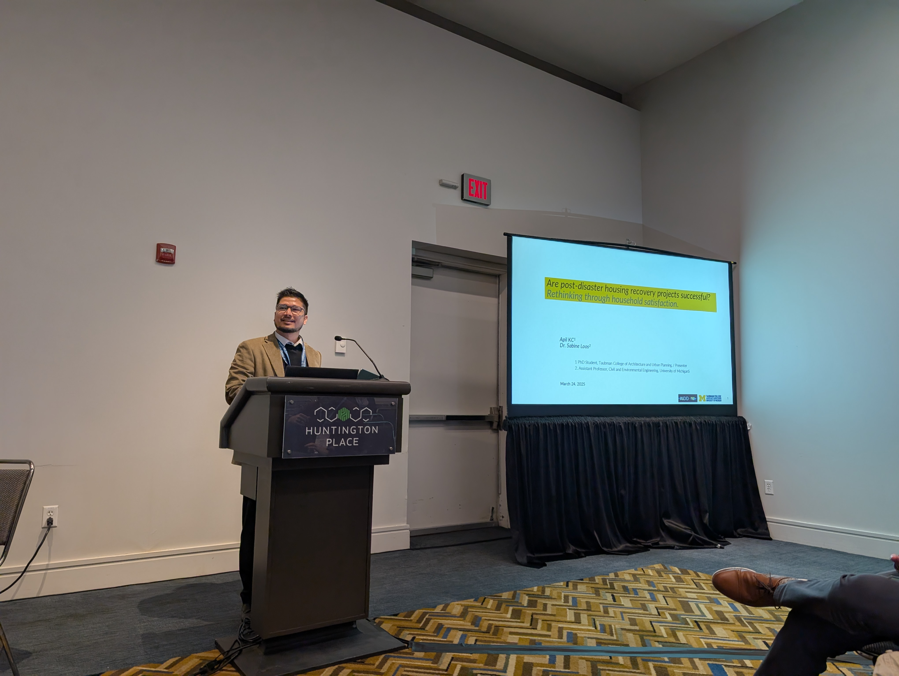
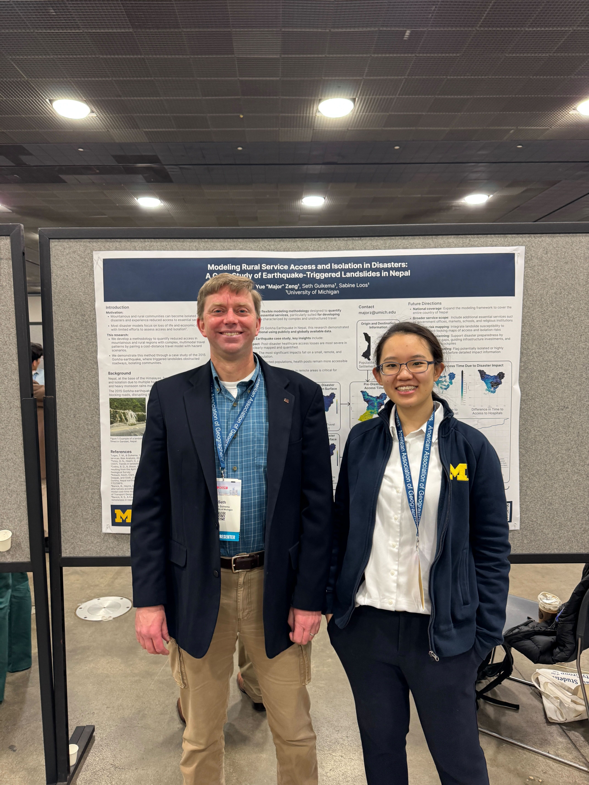
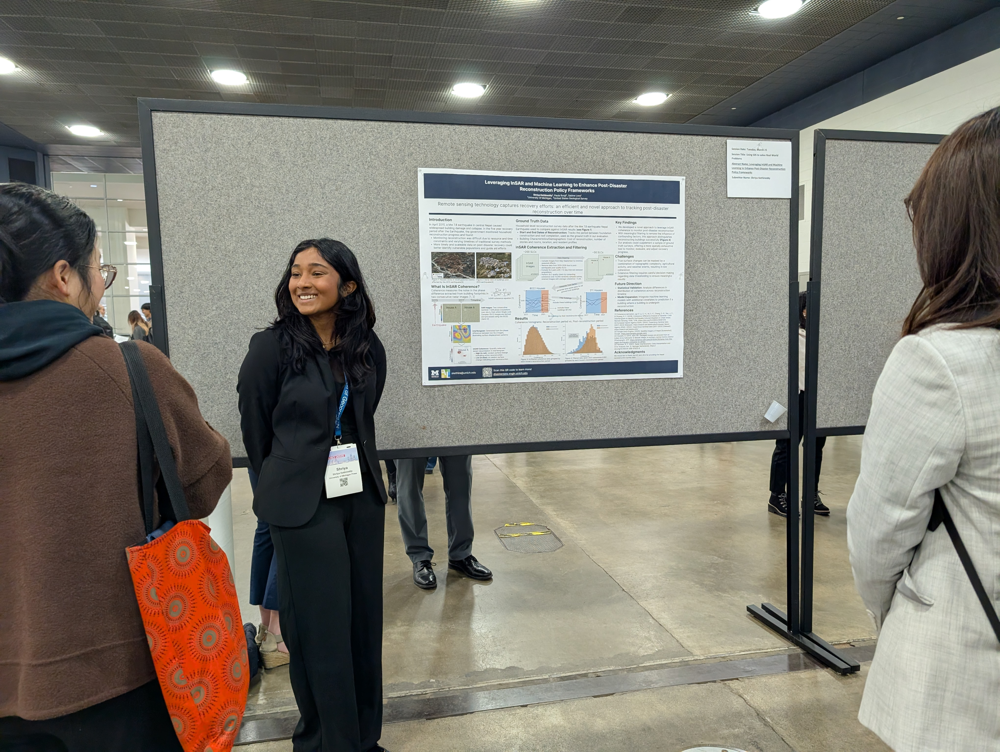

### Sabine Loos and Apil K C participate in session on Disaster Recovery through a Geographic Lens
Sabine Loos co-convened two sessions titled "Disaster Recovery through a Geographic Lens" with [Hannah Friedrich, PhD Candidate at University of Arizona](https://hannahkfriedrich.com/) and [Dr. Ronald Schumann, Associate Professor at University of North Texas](https://hps.unt.edu/people/ronald-schumann-iii-phd.html). This session brought together many researchers drawing from geography through spatial analysis, mixed methods, and application to study disaster recovery. 

Apil K C, presented in this session on "Are post-disaster housing approaches successful? Rethinking through household satisfaction"

Both sessions were well attended and encouraged discussion on how we can bring forward the field of disaster recovery studies.

### Major Zeng and Shriya Kethireddy presented posters on recovery and access
Major Zeng presented her work on "Modeling Rural Service Access and Isolation in Disasters: A Case Study of Earthquake-Triggered Landslides in Nepal"

  <em>Photo (left to right): Dr. Seth Guikema and Major Zeng.</em>

Shriya Kethireddy presented her work on "Leveraging InSAR and Machine Learning to Enhance Post-Disaster Reconstruction Policy Frameworks"

### Brad Bottoms presented in a Flood Risk session on his Flood Resilience Assessment Index
Brad Bottoms presented on "Utilizing Dasymetric Interpolation and Network Analysis for Enhanced Flood Resilience Metrics." More details on this work can be found here:

Bottoms B, Arbit J, Lewis E, et al. (2024) Towards urban place-based resilience modeling: Mixed methods for a flood resilience assessment index. Environment and Planning B: Urban Analytics and City Science 51(7). SAGE Publications Ltd STM: 1563–1580. [https://doi.org/10.1177/23998083241243104](https://doi.org/10.1177/23998083241243104)