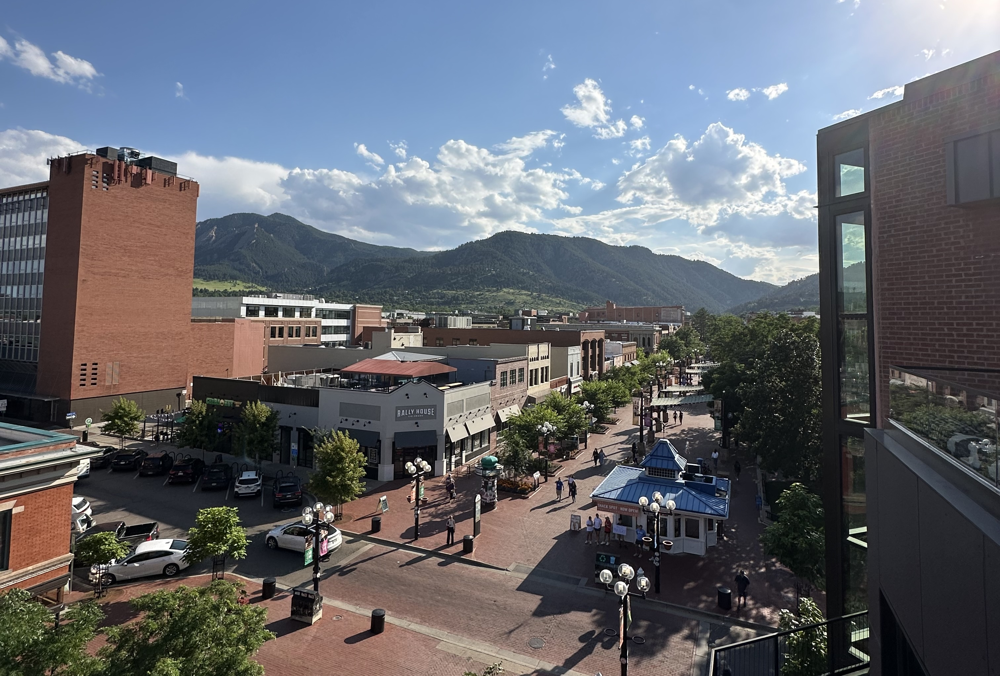
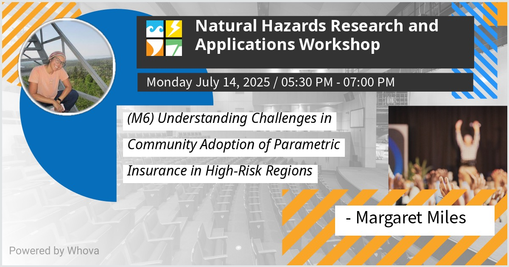
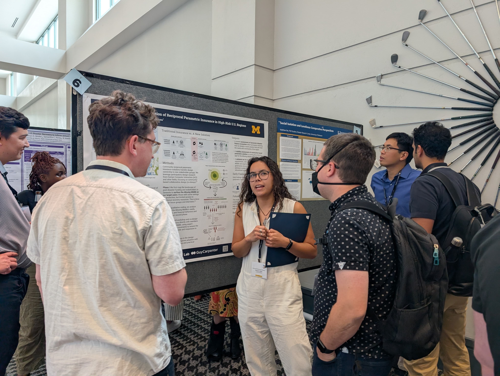
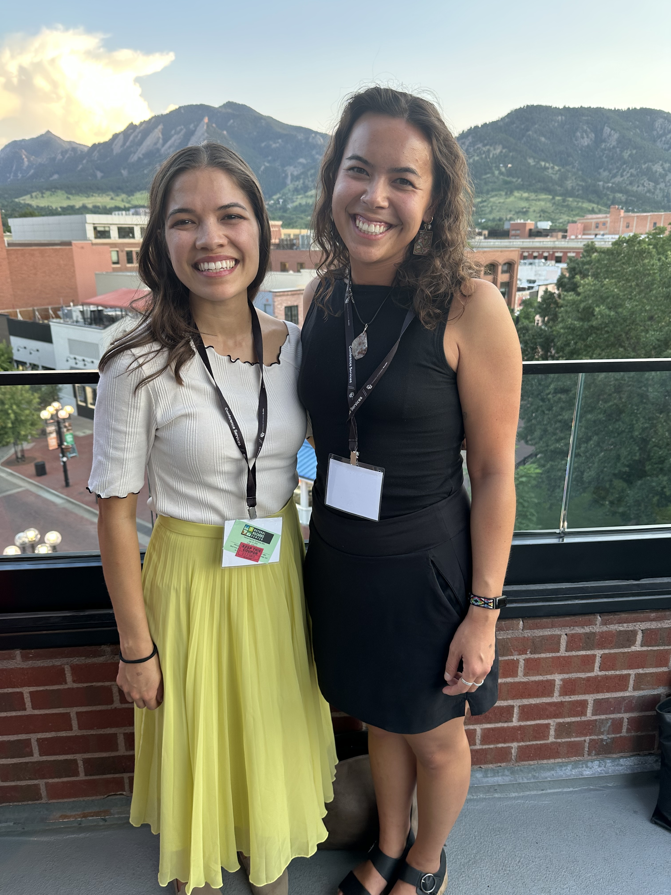

 

AIDD Labs members Margaret Miles and Dr. Sabine Loos attended the 75th Annual Natural Hazards Workshop, held July 14–17, 2025, in Broomfield, Colorado. Hosted by the Natural Hazards Center, this long-standing event brought together a diverse community of practitioners, researchers, and policymakers focused on advancing disaster risk reduction and resilience.

## Poster Session 
 

 

At the poster session, Margaret presented preliminary insights from ongoing research on community parametric disaster insurance. Her poster, titled Understanding Challenges in Community Adoption of Parametric Insurance in High-Risk Regions, explored how Sarasota County, FL residents perceive novel, community-based insurance models intended to close the growing disaster protection gap. [The work](/projects/examining-community-needs-for-parametric-insurance), co-led by Dr. Loos and Dr. Kramer of EDGE labs, with support from Dr. Guillermo Franco of Guy Carpenter, emphasizes participatory methods and cross-sector collaboration in developing actionable resilience tools.

 

## Margaret awarded the Rising Star Award from NAAHDRI 
At the Natural Hazard Workshop, Margaret was one of three graduate students to be awarded the Rising Star Award from the North American Alliance of Hazards and Disaster Research Institutes (NAAHDRI). This award recognized the three best graduate student posters at the conference, acknowledging technical and presentation quality, novelty, and contribution to the field.  

 

## Other Learnings
Beyond sharing AIDD Labs’ research, attending the workshop offered a valuable opportunity to connect with interdisciplinary experts, explore emerging hazard mitigation strategies, and reflect on the systemic barriers that affect equitable disaster preparedness and recovery. We look forward to building on these conversations in our future projects.
