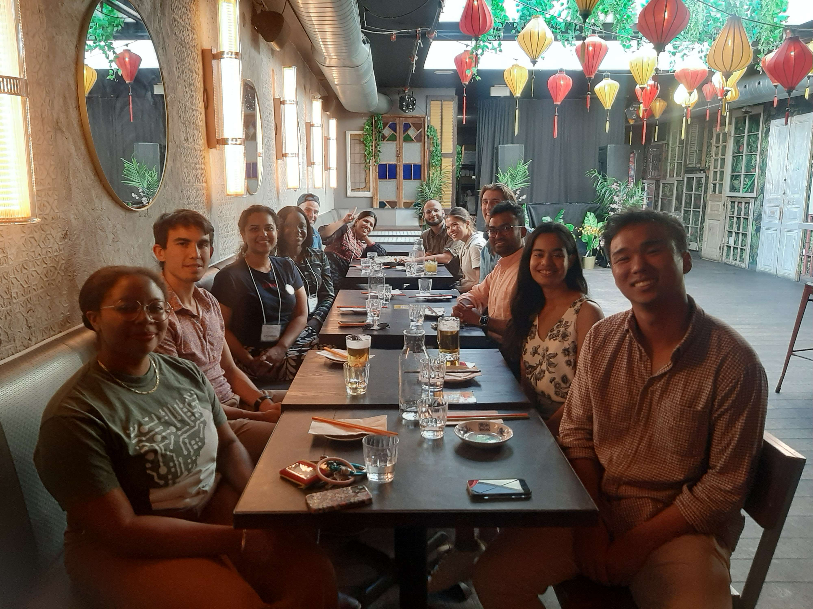

--- 
slug: compassDC
title: Sabine Loos co-chairs the ACM COMPASS Doctoral Consortium
createdDate: 2025-07-22
date: 2025-07-22
status: draft
type: conference
url: https://compass.acm.org/call-for-doctoral-consortium/
members:
  - sabine-loos
description: Dr. Sabine Loos co-chaired the ACM Doctoral Consortium held in Toronto, Canada on July 22, 2025.
---
Dr. Sabine Loos co-chaired the ACM Doctoral Consortium held in Toronto, Canada on July 22, 2025.
This was a two-day event, co-chaired with [Dr. Sachin Pendse (UCSF)](https://www.sachinpendse.in/) and [Dr. Samar Sabie (University of Toronto)](https://www.samarsabie.com/). Attendees included early career PhD students and postdocs interested in Computing and Sustainability (largely with backgrounds in Human Computer Interaction) from around the globe.

<em> Photo: Dr. Loos with attendees of the 2025 COMPASS Doctoral Consortium.</em>
