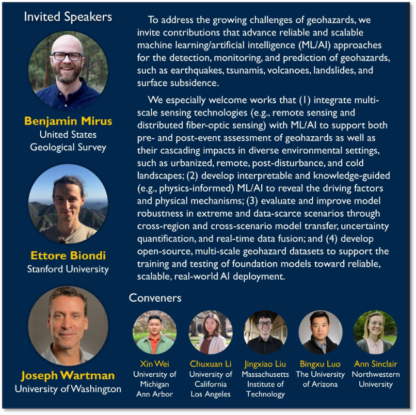
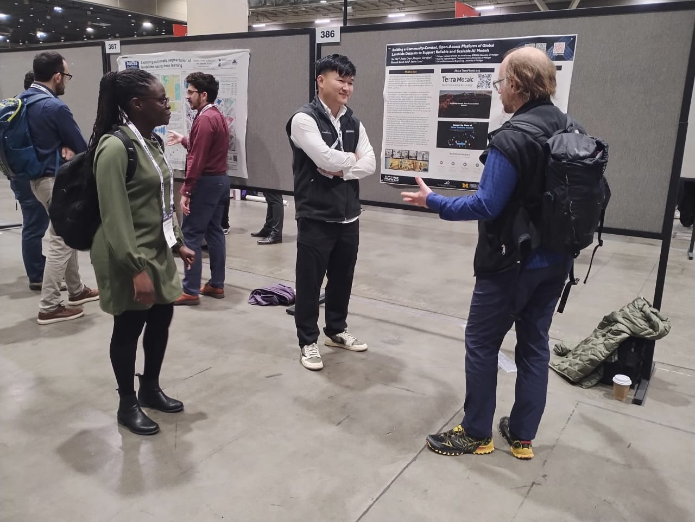

## 🌍 **Leadership and Research Contributions at AGU 2025**

Dr. Wei contributed to AGU 2025 through both scientific leadership and research dissemination. He presented his research in the oral session *“NH31B – Landslide Life Cycle: From Hazard Analysis to Risk Assessment”*, which brought together studies spanning landslide characterization, susceptibility and risk modeling, and hazard communication. He also served as the Primary Convener of the session *“NH33B – Toward Reliable and Scalable Geohazard Intelligence: From Multiscale Sensing to Open Data Foundations”*, leading discussions on reliable and interpretable AI methods, multiscale sensing, and open datasets for geohazard analysis, alongside presenting poster work aligned with these themes.

<!-- --- -->

### 1️⃣ **Primary Convener: “Toward Reliable and Scalable Geohazard Intelligence: From Multiscale Sensing to Open Data Foundations”** ([Poster Session](https://agu.confex.com/agu/agu25/meetingapp.cgi/Session/252469) · [Oral Session](https://agu.confex.com/agu/agu25/meetingapp.cgi/Session/269627))

<!-- ### 1️⃣ **Primary Convener: “Toward Reliable and Scalable Geohazard Intelligence: From Multiscale Sensing to Open Data Foundations” (Poster and Oral Sessions)**   -->
<!-- *(Co-convened with Chuxuan Li, Jingxiao Liu, Bingxu Luo, and Ann Sinclair)*  -->

<!-- **Primary Convener**  
Xin Wei — University of Michigan, Ann Arbor  

**Conveners**  
Chuxuan Li — University of California, Los Angeles  
Jingxiao Liu — Massachusetts Institute of Technology  
Bingxu Luo — The University of Arizona  
**Student / Early Career Convener**  
Ann Sinclair — Northwestern University   -->

To address the growing challenges of geohazards, we invite contributions that advance reliable and scalable machine learning/artificial intelligence (ML/AI) approaches for the detection, monitoring, and prediction of geohazards, such as earthquakes, tsunamis, volcanoes, landslides, and surface subsidence. We especially welcome works that (1) integrate multi-scale sensing technologies (e.g., remote sensing and distributed fiber-optic sensing) with ML/AI to support both pre- and post-event assessment of geohazards as well as their cascading impacts in diverse environmental settings, such as urbanized, remote, post-disturbance, and cold landscapes; (2) develop interpretable and knowledge-guided (e.g., physics-informed) ML/AI to reveal the driving factors and physical mechanisms; (3) evaluate and improve model robustness in extreme and data-scarce scenarios through cross-region and cross-scenario model transfer, uncertainty quantification, and real-time data fusion; and (4) develop open-source, multi-scale geohazard datasets to support the training and testing of foundation models toward reliable, scalable, real-world AI deployment.

<!-- --- -->

### 2️⃣ **Oral Presentation (Highlighted): “Unveiling the Underappreciated Consequences of Landslides across the United States with Generative AI”** ([Link](https://agu.confex.com/agu/agu25/meetingapp.cgi/Paper/1938874))

<!-- *(with Vaibhav Balloli, Lauren Palermo, Benjamin B. Mirus, Nathan J. Wood, Alice Pennaz, Aleeza Wilkins, Elizabeth Bondi-Kelly, and Sabine Loos)*  -->

**First Author**  
Xin Wei — Michigan Institute for Data and AI in Society, University of Michigan, Ann Arbor, MI

**Authors**  
Vaibhav Balloli — Electrical Engineering and Computer Science, University of Michigan, Ann Arbor, MI  
Lauren Palermo — Geologic Hazards Science Center, U.S. Geological Survey, Golden, CO  
Benjamin B. Mirus — Geologic Hazards Science Center, U.S. Geological Survey, Golden, CO  
Nathan J. Wood — Western Geographic Science Center, U.S. Geological Survey, Moffett Field, CA  
Alice Pennaz — Office of Risk and Resilience, U.S. Geological Survey, Reston, VA  
Aleeza Wilkins — Office of Risk and Resilience, U.S. Geological Survey, Reston, VA  
Elizabeth Bondi-Kelly — Electrical Engineering and Computer Science, University of Michigan, Ann Arbor, MI  
Sabine Loos — Civil and Environmental Engineering, University of Michigan, Ann Arbor, MI  

**Abstract**  
While landslides are pervasive across the U.S., their specific social, economic, and ecological impacts remain underappreciated due to their localized and episodic nature, co-occurrence with other hazards, and variability across broad regions. Efforts to systematically quantify landslide impacts have often been limited to localized case studies, carried out by numerous agencies with differing standards, and constrained to limited time frames due to labor-intensive data collection. In this study, we leverage generative AI to develop an agentic framework, composed of a series of agents with increasingly focused tasks, capable of extracting and synthesizing diverse web sources to capture the full range of direct and indirect landslide impacts. This work builds on a national landslide damage and loss dataset that was compiled by the U.S. Geological Survey (USGS) through manual identification. While this manual approach significantly advanced national-scale understanding of landslide impacts and helped establish new guidelines for a database structure, it underscored the time-intensive nature of retroactive assessment and the limitations of adhering to readily searchable government reports and published literature. Therefore, the agentic framework we developed provides a scalable alternative workflow by automatically performing data preprocessing (e.g., text recognition, extraction, and cleaning), identifying landslide impact records, merging complementary records, detecting time-evolving records, and flagging conflicting records for expert review. This framework synthesizes sources from both traditional repositories (e.g., government reports) and more dispersed sources (e.g., news articles, non-governmental organization reports). Preliminary findings demonstrate how the framework captures direct losses, such as the number of fatalities, injuries, or damages, which are expected but have not been consistently quantified. Additionally, underappreciated indirect landslide consequences have been discovered, such as environmental degradation, public health concerns, and legal actions. Overall, this study presents a framework for leveraging generative AI to better capture the full range of consequences of landslides, and potentially other natural hazards.

<!-- --- -->

### 3️⃣ **Poster Presentation: “Building a Community-Curated, Open-Access Platform of Global Landslide Datasets to Support Reliable and Scalable AI Models”** ([Link](https://agu.confex.com/agu/agu25/meetingapp.cgi/Paper/1915796)) 

**First Author**  
Xin Wei — University of Michigan, Ann Arbor  

**Authors**  
Reiko Chen — University of Michigan, Ann Arbor  
Margaret Gereghty — University of Michigan, Ann Arbor  
Elizabeth Bondi-Kelly — University of Michigan, Ann Arbor  
Sabine Loos — University of Michigan, Ann Arbor  

**Abstract**  
Recent advances in machine learning (ML) and deep learning (DL) have significantly advanced landslide-related applications, including detection, early warning, and susceptibility mapping. Generative AI technologies further offer new opportunities to accelerate landslide research, particularly by supporting rapid prototyping and iteration of ML/DL workflows. However, most existing models are trained on datasets specific to certain regions or landslide types, resulting in poor or untested generalization across different geographic and environmental settings. While there have been growing efforts to publish open-access landslide datasets, these resources remain fragmented across individual publications, institutional repositories, and project-specific websites. As a result, researchers often spend substantial time locating, retrieving, and preparing data when building models for new regions. Progress remains constrained by the lack of high-quality, high-volume, standardized, and accessible datasets. To address this gap, we present a community-curated, open-access, evolving platform that aggregates global landslide inventories and related geospatial data, and provides detailed metadata for each dataset. Metadata fields include inventory type (e.g., point, polygon), record count, spatial resolution, geographic coverage, input features (e.g., optical imagery, elevation, land use), ML/DL models used, evaluation settings, and whether cross-regional generalization was tested. Users can search, filter, and download datasets through an interactive, map-based interface. The platform also encourages community contributions via an easy-to-use upload interface. It serves as a central hub for high-quality, globally sourced landslide and geospatial data, supporting the development and benchmarking of reliable, scalable, and generalizable AI models for both fundamental research and real-world applications.

<!--  -->

---

## 🛰️ **RESEARCH PROGRESS IN POST-DISASTER RECOVERY MONITORING — Evaluating machine learning models for predicting post-disaster reconstruction using InSAR: a case study of the 2015 Nepal earthquake** ([Link](https://agu.confex.com/agu/agu25/meetingapp.cgi/Paper/1990557))

Shriya Kethireddy presented her research, highlighting a scalable remote-sensing-based approach to monitor and predict household reconstruction stages following major earthquakes. Her work demonstrated how uncertainty-aware modeling and machine learning can improve the reliability of reconstruction signals derived from InSAR coherence, supporting scalable and data-driven recovery assessment in regions where ground surveys are difficult to conduct.  

Traditional post-disaster household recovery surveys are often constrained by time and resources, which limits their scalability for evaluating post-disaster policy frameworks. Since reconstruction outcomes after major earthquakes play a critical role in long-term community recovery, developing scalable and timely monitoring tools is essential. This study presents a data-driven approach to remotely monitor and predict household reconstruction stages using InSAR (Interferometric Synthetic Aperture Radar) coherence data following the 2015 Nepal earthquake. Building on prior analyses that indicate InSAR coherence is sensitive to surface changes associated with rebuilding activity when leveraging probabilistic modeling, we apply more advanced machine learning models to better capture nonlinear patterns and spatial dependencies. To further account for inherent noise in InSAR coherence, which is pronounced in Nepal due to its diverse weather patterns, extensive farmland, and complex topography, we apply an uncertainty model to appropriately weight coherence inputs. This approach enables our machine learning models to more reliably distinguish reconstruction-related surface changes from background variation. To assess the applicability of predictive modeling for identifying household reconstruction progress using InSAR, we conduct a comparative evaluation of several machine learning approaches using coherence data and a household recovery survey of over 8,500 households from the 2015 Nepal earthquake. Models tested in our approach include logistic regression, recurrent neural networks, and ensemble methods such as voting classifiers. In addition to coherence data, models incorporate topographic variables, vegetation indices, and weather information to account for noise and improve spatial generalization.This work contributes toward developing a scalable, automated tool for real-time monitoring of regional reconstruction progress. The integration of remote sensing and predictive modeling offers a promising direction for enhancing post-disaster recovery assessment, particularly in regions where ground-based data collection is limited. Future work will evaluate model generalizability across events and explore deployment in operational recovery planning platforms.

 

---

## 🔗 **Engagement and Cross-Disciplinary Collaboration**

AIDD Lab’s participation at AGU 2025 underscored a broader commitment to bridging advances in AI, sensing, and hazard engineering to support decision-relevant geohazard analysis. Through community-building efforts and research presentations, the team engaged with a wide range of scientists and practitioners working across hazard processes, data systems, and applied analytics. These interactions strengthened connections between methodological innovation and real-world needs, helping shape shared directions for more robust, transparent, and scalable geohazard science.

